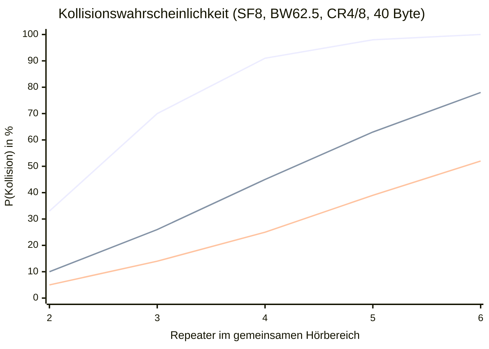

import Tabs from '@theme/Tabs';
import TabItem from '@theme/TabItem';

# Kollisionsanalyse: Timing, Wahrscheinlichkeit & Verbesserungsplan

:::info Kontext
Alle Analysen beziehen sich auf **EU/UK Narrow (SF8, BW 62,5 kHz, CR 4/8)**, Firmware `simple_repeater`, Stand März 2026.
:::

---

## 1. Das Problem: Synchronisierter Trigger

Wenn ein Paket im Mesh geflutet wird, reagieren alle Repeater in Hörweite auf dasselbe Ereignis: das Ende des empfangenen Pakets. Jeder würfelt danach eine Verzögerung aus **demselben Zufallsfenster**. Die Kollisionswahrscheinlichkeit steigt damit schnell mit der Anzahl gleichzeitig reagierender Repeater.

---

## 2. Grundgrößen bei SF8, BW 62,5 kHz, CR 4/8

```
Symboldauer T_s = 2^8 / 62.500 ≈ 4,096 ms
```

Airtime für ein typisches Flood-Paket mit 40 Byte Nutzlast:

| Komponente | Symbole | Zeit |
|---|---|---|
| Preamble (8 Sym. + 4,25 Overhead) | 12,25 | 50 ms |
| Payload (CR 4/8, kein LDR) | 96 | 393 ms |
| **Gesamt** | **108,25** | **≈ 443 ms** |

**Jede Kollision macht beide Pakete unlesbar und kostet mindestens 443 ms Kanalkapazität.**

---

## 3. Timing-Analyse: Wann schlägt die Kollisionserkennung an?

MeshCore nutzt `PREAMBLE_DETECTED`-IRQ-Flags des SX1262 als primäre Kollisionserkennung. Entscheidend ist: **wann genau feuert dieses Flag?**

### 3.1 `isReceivingPacket()`: Reaktiv, nach Korrelatoranlauf

```cpp title="CustomSX1262.h"
bool isReceivingPacket() {
  uint16_t irq = getIrqFlags();
  return (irq & SX126X_IRQ_HEADER_VALID) || (irq & SX126X_IRQ_PREAMBLE_DETECTED);
}
```

Der interne Korrelator des SX1262 muss genug Up-Chirp-Symbole akkumulieren, bevor er das Flag setzt. Bei SF8:

| Zustand | Zeitpunkt nach TX-Start des anderen |
|---|---|
| Preamble beginnt | 0 ms |
| `PREAMBLE_DETECTED` feuert | **≈ 16-25 ms** (4-6 Symbole × 4,096 ms) |
| `HEADER_VALID` feuert | ≈ 67 ms (Preamble + Sync Word) |
| Payload läuft | ab ≈ 67 ms |

**Kritisches Kollisionsfenster:** Wenn Node B seinen TX innerhalb von **≤ 16-25 ms** nach Node A startet, hat `PREAMBLE_DETECTED` noch nicht gefeuert. Node B sieht einen freien Kanal und sendet trotzdem.

### 3.2 Hardware-CAD: Proaktiv, 4x schneller

Der PR [#1727](https://github.com/meshcore-dev/MeshCore/pull/1727) implementiert Hardware-CAD (`scanChannel()`) als aktiven Scan unmittelbar vor TX:

| Mechanismus | Erkennungszeit | Typ |
|---|---|---|
| `PREAMBLE_DETECTED` IRQ | ≈ 16-25 ms nach TX-Start | reaktiv (passiv) |
| Hardware-CAD (1 Symbol) | ≈ 4 ms | proaktiv (aktiver Scan) |
| Hardware-CAD (2 Symbole) | ≈ 8 ms | proaktiv (aktiver Scan) |

CAD sucht spezifisch nach dem **Up-Chirp-Muster** der Preamble und benötigt nur 1-2 Symbole, weil es gezielt nach dem LoRa-Muster scannt statt auf Korrelatorkonvergenz zu warten. Das kritische Fenster schrumpft dadurch von ≈ 20 ms auf ≈ 4 ms.

### 3.3 Mid-Packet-Erkennung: Strukturelle Lücke

Beide Mechanismen schützen nur gegen Preambles. Ein Paket, dessen Preamble nicht gehört wurde (weil der Node gerade aus TX zurückkam und `startReceive()` die IRQ-Flags resettet), ist weder per CAD noch per IRQ erkennbar:

| Szenario | CAD | Preamble-IRQ | RSSI-LBT |
|---|:---:|:---:|:---:|
| Preamble läuft, jetzt erkannt | ✓ | ✓ (nach 4-6 Sym.) | ✓ (wenn stark genug) |
| Preamble verpasst, Payload läuft | ✗ | ✗ | ✓ (wenn stark genug) |
| Schwaches Signal unter Noise Floor | ✗ | ✗ | ✗ |

**Fazit:** Es gibt kein Hardware-Feature das zuverlässig mid-packet erkennt wenn die Preamble verpasst wurde. LoRa dekodiert Signale bis zu 20 dB unterhalb des Noise Floors, RSSI-LBT ist daher für den Fernbereich strukturell ungeeignet.

---

## 4. Kollisionswahrscheinlichkeit

### Methodik

Für ein kontinuierliches Zufallsfenster (Pure ALOHA) gilt die Poisson-Näherung:

```
P(≥1 Kollision) ≈ 1 − e^(−N×(N−1)×T / (2×W))
```

mit Paketdauer T (= Kollisionsfenster) und Fensterlänge W.

### Ergebnisse (T = 443 ms)

| Repeater N | txdelay 0,5 (Default, W=1107 ms) | txdelay 2,0 (Max, W=4430 ms) | txdelay 4,0 (W=8860 ms) |
|---|---|---|---|
| 2 | 33 % | 10 % | 5 % |
| 3 | **70 %** | 26 % | 14 % |
| 4 | 91 % | 45 % | 25 % |
| 5 | 98 % | 63 % | 39 % |
| 6 | ≈100 % | 78 % | 52 % |



:::danger Kernbefund
Mit dem **Standard-txdelay von 0,5** ist eine Kollision ab **3 Repeatern** wahrscheinlicher als nicht. Bei 4+ Repeatern nahezu sicher.
:::

---

## 5. PR-Bewertung

### PR #1727: Hardware-CAD statt RSSI-LBT

[PR #1727](https://github.com/meshcore-dev/MeshCore/pull/1727) ersetzt `isChannelActive()` vom RSSI-basierten Vergleich auf echten Hardware-CAD (`scanChannel()`). Zusätzlich wird der Default von `interference_threshold` auf `1` erhöht (aktiviert CAD).

```cpp title="RadioLibWrappers.cpp (nach PR #1727)"
bool RadioLibWrapper::isChannelActive() {
  if (_threshold == 0) return false;
  int16_t result = performChannelScan();
  state = STATE_IDLE;
  startRecv();   // CAD-Done-IRQ sauber zurücksetzen
  return result != RADIOLIB_CHANNEL_FREE;
}
```

<Tabs>
  <TabItem value="positiv" label="Verbesserungen">

- **4x schnellere Erkennung**: CAD detektiert nach ~4 ms (1 Symbol) statt nach ~16-25 ms
- **Keine Kalibrierung nötig**: Noise-Floor-Konvergenz entfällt, sofort verlässlich
- **LoRa-spezifisch**: Reagiert auf Chirp-Muster, nicht auf allgemeine RF-Energie
- **ISR korrekt behandelt**: State-Reset und RX-Neustart nach CAD verhindert, dass der CAD-Done-Interrupt als empfangenes Paket fehlinterpretiert wird

  </TabItem>
  <TabItem value="grenzen" label="Grenzen & Implementierungsmängel">

**Konzeptionelle Grenzen:**

- **Nur Preamble-Erkennung**: Kein Schutz wenn Preamble verpasst wurde
- **Schließt das kritische Fenster nicht vollständig**: Zwei Nodes die gleichzeitig CAD "clear" bekommen und gleichzeitig starten, kollidieren trotzdem
- **Grundproblem bleibt**: Das schmale Zufallsfenster (Pure ALOHA ohne Slots) ist die eigentliche Ursache häufiger Kollisionen

**Implementierungsmängel (merge-relevant):**

- **CAD und TX nicht atomar**: Der CAD-Check läuft in `checkSend()` über `isReceiving()`, danach folgt Paket-Serialisierung (Header, Path, Payload kopieren), erst dann `startSendRaw()`. Zwischen CAD-Ergebnis und TX-Start vergehen mehrere Millisekunden; ein anderer Node der in diesem Fenster startet, wird nicht erkannt. Fix: CAD nochmals direkt vor `startSendRaw()` aufrufen.
- **Threshold-Wert wird ignoriert**: `_threshold` war ursprünglich der RSSI-Schwellwert in dB. Nach dem PR wird nur noch geprüft ob er `== 0` ist, der eigentliche Wert hat keinen Effekt mehr. `set int.thresh 1` und `set int.thresh 14` verhalten sich identisch. Das ist semantisch irreführend; ein separates `_cad_enabled`-Flag wäre korrekt.
- **Kurzzeitiger Blind Spot nach CAD**: Nach dem Scan versetzt `startRecv()` das Radio zurück in RX. Während des RX-Hochlaufs (einige hundert µs) ist das Radio blind; eine Preamble die genau in diesem Fenster beginnt, wird weder per CAD noch per IRQ erkannt.

  </TabItem>
</Tabs>

**Bewertung:** Funktional sinnvoll und korrekt implementiert was den ISR-Reset betrifft. Die drei Implementierungsmängel sind reale Lücken, insbesondere der nicht-atomare CAD/TX-Abstand. Als-ist mergebar wenn man die konzeptionellen Grenzen akzeptiert; für produktionsreife Kollisionsvermeidung sollte zumindest der CAD-vor-TX Fix nachgezogen werden.

---

## 6. Verbesserungsplan

### 6.1 Sofortmaßnahmen (Konfiguration)

**`set txdelay 2.0`**: größtes Hebelpotenzial bei geringstem Aufwand:

| Repeater im Hörbereich | Empfehlung | P(Kollision, N=3) |
|---|---|---|
| 2-3 | `txdelay 1.0` | 42 % |
| 4-5 | `txdelay 2.0` | 26 % |
| > 5 | Cap-Erhöhung nötig (s.u.) | < 15 % |

:::warning Cap-Erhöhung erforderlich
`txdelay` ist firmware-seitig auf 2,0 begrenzt (`constrain(..., 0, 2.0f)` in `CommonCLI.cpp`). Für höhere Werte muss der Cap im Quellcode angehoben werden.
:::

**`set rx_delay_base 8.0`**: SNR-gewichtetes Backoff aktivieren:

Der Dispatcher enthält bereits einen SNR-basierten Verzögerungsmechanismus, per Default deaktiviert (`rx_delay_base = 0`):

```cpp title="Dispatcher.cpp"
int Dispatcher::calcRxDelay(float score, uint32_t air_time) const {
  return (int)((pow(_prefs.rx_delay_base, 0.85f - score) - 1.0) * air_time);
}
```

Ein Repeater mit schlechtem SNR (weiter entfernt) bekommt damit weniger Verzögerung und sendet früher, was physikalisch sinnvoll ist, da er das Paket für entferntere Empfänger weiterleitet. Ein Repeater nahe am ursprünglichen Sender wartet länger.

**`set af 9`** für gesetzeskonformen Betrieb im deutschen 868-MHz-Band.

### 6.2 Kurzfristig: PRs mergen

| PR | Maßnahme | Wirkung |
|---|---|---|
| [#1727](https://github.com/meshcore-dev/MeshCore/pull/1727) | Hardware-CAD aktivieren | Kritisches Fenster: 20 ms → 4 ms |

### 6.3 Mittelfristig: Slot-basiertes Backoff

Statt eines kontinuierlichen ms-Fensters (Pure ALOHA) könnten **diskrete Slots** eingeführt werden, wobei die Slot-Dauer der CAD-Scan-Zeit entspricht:

```
Slot-Dauer = 1-2 Symbole ≈ 4-8 ms (= Hardware-CAD-Dauer)
Anzahl Slots = konfigurierbar (z. B. 100-500)
Delay = random(0, N_slots) × slot_duration
```

**Warum das hilft:** Zwischen zwei möglichen TX-Startzeitpunkten liegt dann immer mindestens ein CAD-Zyklus. Hardware-CAD als Guard direkt vor TX wird damit strukturell wirksam, statt zufällig.

### 6.4 Mittelfristig: CAD direkt vor `startSendRaw()`

Aktuell läuft der CAD-Check nur über den `loop()`-Poll-Pfad. Eine explizite Prüfung direkt vor dem Senden schließt die Poll-Latenz-Lücke:

```cpp title="Dispatcher.cpp"
if (_radio->isChannelActive()) {
  next_tx_time = futureMillis(getCADFailRetryDelay());
  return;
}
bool success = _radio->startSendRaw(raw, len);
```

Das entspricht dem CSMA/CA-Grundprinzip: last-moment check unabhängig vom Poll-Intervall.

### 6.5 Langfristig: Adaptives Contention Window

Analog zu Meshtastics Ansatz könnte das Backoff-Fenster dynamisch skalieren, z. B. nach Hop-Count oder erkannter Kanalauslastung:

```
W = base_slots × 2^(hop_count)
```

---

## 7. Maßnahmenübersicht

| Priorität | Maßnahme | Aufwand | Wirkung |
|---|---|---|---|
| 🔴 Sofort | `set txdelay 2.0` + Cap auf 8,0 erhöhen | Minimal | P(N=3): 70 % → 26 % |
| 🔴 Sofort | `set rx_delay_base 8.0` | Minimal | Natürliche SNR-Entzerrung |
| 🔴 Sofort | `set af 9` (DE/868 MHz) | Minimal | Gesetzeskonformität |
| 🟡 Kurzfristig | PR #1727 mergen (Hardware-CAD) | Niedrig | Fenster 20 ms → 4 ms |
| 🟢 Mittelfristig | CAD direkt vor `startSendRaw()` | Mittel | Lücke durch Poll-Latenz schließen |
| 🟢 Mittelfristig | Slot-basiertes Backoff (CAD-Slot-Dauer) | Mittel | Strukturelle Kollisionsvermeidung |
| 🔵 Langfristig | Adaptives Contention Window | Hoch | Skaliert mit Netzgröße |

:::tip Wichtigstes zuerst
`txdelay` und `rx_delay_base` sind sofort konfigurierbar und haben den größten Hebel bei geringstem Aufwand. Slot-basiertes Backoff ist die strukturell richtige Lösung, erfordert aber Code-Änderungen.
:::

---

## 8. Vergleich: Meshtastic

<Tabs>
  <TabItem value="besser" label="Was Meshtastic besser macht">

### Slotted ALOHA mit adaptivem Contention Window

```cpp title="Meshtastic: RadioInterface.cpp"
uint8_t CWsize = map(channelUtilizationPercent(), 0, 100, CWmin, CWmax);
delay = random(0, pow_of_2(CWsize)) * slotTimeMsec;
```

Die Slot-Zeit entspricht exakt der CAD-Scan-Dauer plus Propagationszuschlag, zwischen zwei möglichen Startzeitpunkten liegt immer mindestens ein CAD-Zyklus. Hardware-CAD als Guard direkt vor TX wird damit strukturell wirksam.

### SNR-gewichteter Offset für Relay-Nodes

Nodes mit schlechtem SNR senden früher, deckt sich mit dem `rx_delay_base`-Mechanismus in MeshCore.

  </TabItem>
  <TabItem value="kritisch" label="Was kritisch zu sehen ist">

### Keine RSSI-Erkennung

Meshtastic hat keinen RSSI-Fallback. Breitband-Interferenz (kein LoRa-Preamble) wird nicht erkannt. MeshCores `int.thresh` kann das zumindest teilweise abdecken.

### Konfigurierbarkeit fehlt

CAD-Parameter sind Kompilier-Zeit-Konstanten. MeshCores CLI-Interface (`set txdelay`, `set int.thresh`) ist flexibler für Netzwerkbetreiber.

### Bekannte Bugs

Historisch gab es mehrere Bugs in der Slot-Zeit-Berechnung (zu starr, falsche Bitshift-Auswertung, fixe statt dynamische Werte). Die Komplexität hat ihren Preis.

  </TabItem>
</Tabs>

---

## 9. Relevante Referenzen

- [PR #1727: Hardware-CAD](https://github.com/meshcore-dev/MeshCore/pull/1727)
- [Issue #1716: AGC-Bug Heltec V4](https://github.com/meshcore-dev/MeshCore/issues/1716)
- [Semtech SX1262 Datasheet](https://www.semtech.com/products/wireless-rf/lora-core/sx1262)
- [Semtech CAD Application Note AN1200.85](https://www.semtech.com/uploads/technology/LoRa/cad-ensuring-lora-packets.pdf)
