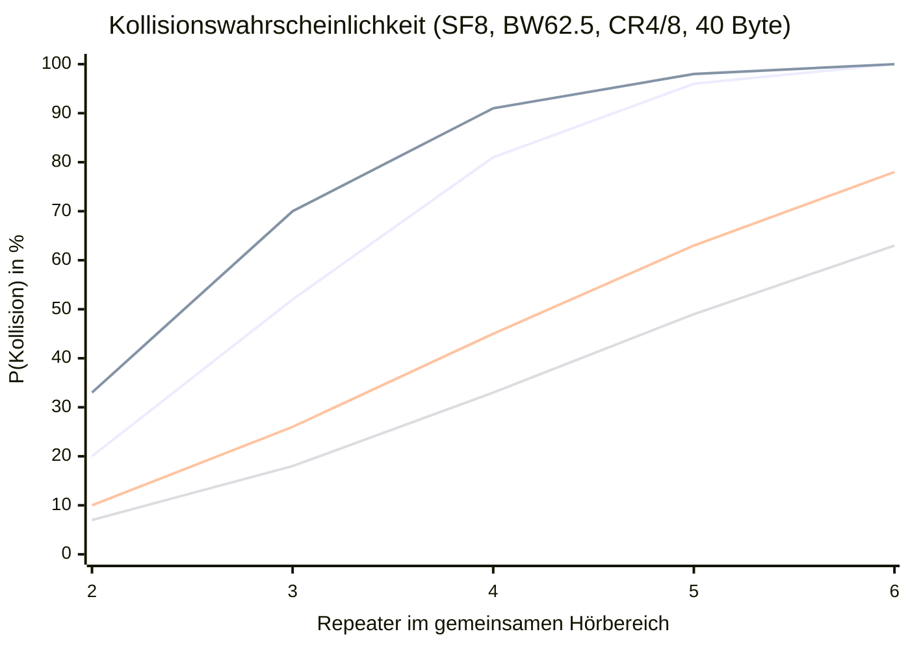

import Tabs from '@theme/Tabs';
import TabItem from '@theme/TabItem';

# Kollisionsanalyse: Repeater, Timing & Lösungsansätze

:::info Kontext
Alle Messungen und Codeanalysen beziehen sich auf **EU/UK Narrow (SF8, BW 62,5 kHz, CR 4/8)**.
Firmware-Referenz: `MeshCore` `simple_repeater`, Stand März 2026.
:::

---

## 1. Das Problem: Synchronisierter Trigger

Wenn ein Paket im Mesh-Netz geflutet wird, reagieren **alle Repeater, die das Paket hören**, auf dasselbe Ereignis: Sie wollen das Paket retransmittieren. Ihr Startzeitpunkt ist das Ende des empfangenen Pakets — gefolgt von einer zufälligen Verzögerung.

Das Problem: Alle Repeater wählen aus **demselben Zufallsfenster**. Sind mehrere Repeater im gegenseitigen Hörbereich, steigt die Kollisionswahrscheinlichkeit mit jeder weiteren Node schnell.

### Airtime bei SF8, BW 62,5 kHz, CR 4/8

Die LoRa-Symbolzeit:

```
T_s = 2^SF / BW = 256 / 62.500 ≈ 4,096 ms
```

Für ein typisches Flood-Paket mit 40 Byte Nutzlast:

| Komponente | Symbole | Zeit |
|---|---|---|
| Preamble (8 + 4,25 Overhead) | 12,25 | 50 ms |
| Payload (CR 4/8, kein LDR) | 96 | 393 ms |
| **Gesamt** | **108,25** | **≈ 443 ms** |

```
Payload-Symbole = 8 + ⌈(8×40 - 4×8 + 44) / 32⌉ × 8
               = 8 + ⌈332/32⌉ × 8 = 8 + 11×8 = 96
```

**Airtime ≈ 443 ms** — fast eine halbe Sekunde pro Paket. Jede Kollision lässt beide Pakete unlesbar zurück und kostet mindestens diese Zeit Kanalkapazität.

---

## 2. Das Zufallsfenster: Wie viele Slots hat MeshCore?

MeshCore kennt zwei unterschiedliche `getRetransmitDelay()`-Implementierungen.

### 2.1 Basis-Implementierung (`Mesh.cpp`)

```cpp title="MeshCore/src/Mesh.cpp"
uint32_t Mesh::getRetransmitDelay(const mesh::Packet* packet) {
  uint32_t t = (_radio->getEstAirtimeFor(packet->getRawLength()) * 52 / 50) / 2;
  return _rng->nextInt(0, 5) * t;
}
```

`nextInt(0, 5)` liefert **{0, 1, 2, 3, 4}** — genau **5 diskrete Slots**.

Mit Airtime ≈ 443 ms und `t = 443 × 1,04 / 2 ≈ 230 ms`:

| Slot | Verzögerung |
|---|---|
| 0 | 0 ms |
| 1 | 230 ms |
| 2 | 460 ms |
| 3 | 690 ms |
| 4 | 920 ms |

### 2.2 Repeater-Firmware-Override (`simple_repeater/MyMesh.cpp`)

```cpp title="MeshCore/examples/simple_repeater/MyMesh.cpp"
uint32_t MyMesh::getRetransmitDelay(const mesh::Packet *packet) {
  uint32_t t = (_radio->getEstAirtimeFor(...) * _prefs.tx_delay_factor);
  return getRNG()->nextInt(0, 5*t + 1);
}
```

Das Fenster ist **kontinuierlich** in 1-ms-Schritten:

| `txdelay`-Faktor | Fenster | Effektive Slots |
|---|---|---|
| 0,25 (ehemaliger Default) | 0 – 554 ms | 555 |
| **0,5 (aktueller Default)** | **0 – 1.108 ms** | **1.109** |
| 1,0 | 0 – 2.215 ms | 2.216 |
| 2,0 (Maximum¹) | 0 – 4.430 ms | 4.431 |
| 3,0 (ohne Cap¹) | 0 – 6.645 ms | 6.646 |

:::warning Cap auf 2,0
Die Firmware begrenzt `tx_delay_factor` beim Laden auf maximal 2,0 (`constrain(f, 0, 2.0f)` in `CommonCLI.cpp:90`). Ein `set txdelay 3` wird gespeichert, beim nächsten Boot aber auf 2,0 reduziert. Für höhere Werte muss der Cap im Quellcode angehoben werden.
:::

---

## 3. Kollisionswahrscheinlichkeit

### Methodik

Für **5 diskrete Slots** gilt die exakte Geburtstags-Formel:

```
P(≥1 Kollision) = 1 - k! / ((k-N)! × k^N)
```

Für **kontinuierliche Fenster** die Näherung:

```
P(≥1 Kollision) ≈ 1 - e^(−N×(N−1)×T / (2×W))
```

mit Paketdauer T und Fensterlänge W.

### Ergebnisse (T = 443 ms)

| Repeater N | 5 Slots (Basis) | Default txdelay 0,5 | txdelay 2,0 | txdelay 3,0 |
|---|---|---|---|---|
| 2 | 20 % | 33 % | 10 % | 7 % |
| 3 | **52 %** | **70 %** | 26 % | 18 % |
| 4 | 81 % | 91 % | 45 % | 33 % |
| 5 | 96 % | 98 % | 63 % | 49 % |
| 6 | 100 % | ≈100 % | 78 % | 63 % |



:::danger Kernbefund
Mit dem **Standard-txdelay von 0,5** ist eine Kollision ab **3 Repeatern** wahrscheinlicher als nicht. Bei **4+ Repeatern** ist sie nahezu sicher.
:::

---

## 4. Warum LBT zu spät kommt

`checkSend()` prüft in `Dispatcher.cpp` vor jedem Sendeversuch den Kanal:

```cpp title="MeshCore/src/Dispatcher.cpp"
if (_radio->isReceiving()) {  // LBT-Check
    next_tx_time = futureMillis(getCADFailRetryDelay());
    return;
}
// → Transmission starten
```

Auf dem SX1262 bedeutet `isReceiving()`:

```cpp title="CustomSX1262.h"
bool isReceiving() {
  uint16_t irq = getIrqFlags();
  return (irq & SX126X_IRQ_HEADER_VALID) || (irq & SX126X_IRQ_PREAMBLE_DETECTED);
}
```

Diese Flags werden erst gesetzt, **nachdem** das Preamble vom Chip erkannt wurde — also frühestens nach 2 Preamble-Symbolen ≈ 8 ms.

### Das kritische Timing-Problem

```
t = 0 ms     Alle Repeater: Paket empfangen

t = 443 ms   Paket fertig. Jeder würfelt getRetransmitDelay():
               → Repeater A: 460 ms Delay
               → Repeater B: 470 ms Delay   ← 10 ms Unterschied

t = 903 ms   Repeater A: isReceiving()? → NEIN → TX startet, Preamble beginnt

t = 913 ms   Repeater B: isReceiving()?
               SX1262 setzt PREAMBLE_DETECTED nach ~8 ms Preamble-Zeit.
               A's Preamble ist erst 10 ms alt — Erkennung grenzwertig.
               → Im schlechtesten Fall: NEIN → TX startet → KOLLISION
```

### Das kritische Zeitfenster

| Parameter | Wert |
|---|---|
| SX1262 Preamble-Erkennungszeit | ~8 ms (2 Symbole × 4,096 ms) |
| Kritisches Kollisionsfenster | ≤ 8 ms Startzeit-Unterschied |
| Loop-Poll-Intervall (Hardware-abhängig) | ~1–5 ms |

**Fazit:** LBT schlägt fehl, wenn zwei Repeater ihre Transmission innerhalb von ~8 ms starten. Bei einem Zufallsfenster von 1.000+ ms und ms-Auflösung ist das häufig — insbesondere wenn viele Repeater dasselbe Paket hören und ähnliche Zufallszahlen ziehen.

---

## 5. PR #1727: Hardware-CAD — Schritt in die richtige Richtung

[PR #1727](https://github.com/meshcore-dev/MeshCore/pull/1727) ersetzt den RSSI-basierten `isChannelActive()`-Check durch echten Hardware-CAD:

```cpp title="RadioLibWrappers.cpp (nach PR #1727)"
bool RadioLibWrapper::isChannelActive() {
  if (_threshold == 0) return false;
  int16_t result = performChannelScan(); // _radio->scanChannel()
  state = STATE_IDLE;
  startRecv();
  return result != RADIOLIB_CHANNEL_FREE;
}
```

| Was sich verbessert | Was bleibt ungelöst |
|---|---|
| Hardware-CAD erkennt LoRa-Preambles via Chip-Korrelation | CAD-Scan dauert ~8 ms — dasselbe kritische Fenster |
| Erkennt dritte Sender, die unabhängig senden | Zwei Repeater, die beide CAD "clear" bekommen, starten beide |
| State-Machine-Reset korrekt (`state = STATE_IDLE` + `startRecv()`) | Schmales Zufallsfenster als Grundproblem bleibt |

---

## 6. Lösungsansätze

### 6.1 Sofortmaßnahme: txdelay erhöhen

```
set txdelay 2.0
```

Für Werte über 2,0 muss der Cap im Quellcode angehoben werden:

```cpp title="CommonCLI.cpp"
// aktuell:
_prefs->tx_delay_factor = constrain(_prefs->tx_delay_factor, 0, 2.0f);

// empfohlen:
_prefs->tx_delay_factor = constrain(_prefs->tx_delay_factor, 0, 8.0f);
```

**Empfehlung nach Netzgröße:**

| Repeater im Hörbereich | Empfohlenes txdelay | P(Kollision, N=3) |
|---|---|---|
| 2 | 0,5 (Default) | 70 % |
| 3–4 | 2,0 | 26 % |
| 5–6 | 4,0 | 15 % |
| >6 | 6,0+ | < 10 % |

:::note Tradeoff
Höheres `txdelay` verlängert die Latenz bis zum nächsten Hop. Bei `txdelay 2.0` kann die Weiterleitung bis zu 4,4 Sekunden dauern (5 × 443 ms × 2,0).
:::

### 6.2 SNR-basierten Rx-Delay aktivieren

MeshCore enthält bereits einen SNR-gewichteten Verzögerungsmechanismus — der in der Repeater-Firmware standardmäßig **deaktiviert** ist (`rx_delay_base = 0.0`):

```cpp title="Dispatcher.cpp"
int Dispatcher::calcRxDelay(float score, uint32_t air_time) const {
  return (int)((pow(_prefs.rx_delay_base, 0.85f - score) - 1.0) * air_time);
}
```

Ein Repeater mit schlechtem SNR (schwaches Signal, weiter entfernt) bekommt eine kurze Verzögerung und sendet als Erster — was physikalisch sinnvoll ist, da er das Paket für weiter entfernte Empfänger weiterleitet. Ein Repeater mit gutem SNR (nahe am Sender, redundant) wartet länger.

**Empfehlung:** `rx_delay_base` auf 5,0–10,0 setzen:

```
set rx_delay_base 8.0
```

Das entzerrt Kollisionen bei Repeatern mit unterschiedlicher Empfangslage automatisch.

### 6.3 CAD direkt vor `startSendRaw()`

Derzeit läuft der CAD-Check nur über den `loop()`-Poll-Pfad. Eine härtere Absicherung direkt vor der Transmission schließt die Poll-Latenz-Lücke:

```cpp title="Dispatcher.cpp — Vorgeschlagene Ergänzung"
// Direkt vor startSendRaw():
if (_radio->isChannelActive()) {
    next_tx_time = futureMillis(getCADFailRetryDelay());
    return;
}
bool success = _radio->startSendRaw(raw, len);
```

Das entspricht dem CSMA/CA-Grundprinzip: kurz vor dem Senden nochmals prüfen, unabhängig vom Poll-Intervall.

### 6.4 Slot-basiertes Backoff

Statt eines kontinuierlichen ms-Fensters könnten **diskrete Slots mit CAD-Dauer als Einheit** genutzt werden:

```
Slot-Dauer = 2 × Symboldauer ≈ 8 ms
Anzahl Slots = txdelay_factor × 100   (konfigurierbar)
Delay = random(0, N_slots) × slot_duration
```

Bei `N_slots = 100`: Fenster = 800 ms, jeder Slot klar voneinander abgegrenzt. Zwischen zwei möglichen Startzeitpunkten liegt immer mindestens ein CAD-Zyklus — eine strukturelle Verbesserung gegenüber dem aktuellen ms-genauen Zufallsprinzip.

---

## 7. Vergleich: Meshtastic

<Tabs>
  <TabItem value="gut" label="Was Meshtastic besser macht">

### Dynamisches Contention Window

```cpp title="Meshtastic: RadioInterface.cpp"
float channelUtil = airTime->channelUtilizationPercent();
uint8_t CWsize = map(channelUtil, 0, 100, CWmin, CWmax); // CWmin=3, CWmax=8
delay = random(0, pow_of_2(CWsize)) * slotTimeMsec;
```

Bei hoher Kanalauslastung wächst das Fenster automatisch von 8 auf 256 Slots (exponentiell). Zusätzlich skaliert die **Slot-Dauer** mit SF und BW — die Slot-Zeit entspricht exakt der CAD-Dauer plus Propagationszuschlag.

### Strukturelle Eigenschaft

Zwischen zwei möglichen Startzeitpunkten liegt immer mindestens eine CAD-Dauer. Das macht Hardware-CAD als letzten Guard vor TX besonders effektiv.

### SNR-gewichteter Offset für Relay-Nodes

```cpp
uint8_t CWsize = getCWsize(p->rx_snr); // SNR -20..+10 dB → CW 3..8
delay = (2*CWmax * slotTimeMsec) + random(0, pow_of_2(CWsize)) * slotTimeMsec;
```

Nodes mit schlechtem SNR (weiter entfernt) senden früher — physikalisch sinnvoll.

  </TabItem>
  <TabItem value="kritisch" label="Was kritisch zu sehen ist">

### CWmin = 8 Slots bei niedrigem Utilization

In kleinen Netzen ist die Kanalauslastung gering → CWsize bleibt bei CWmin=3 → Fenster = 8 Slots. Das ist kaum besser als MeshCores 5 Slots, zumal ein Slot nur ~15 ms dauert (LongFast): effektives Fenster ≈ 120 ms bei sehr kurzer Airtime.

### Channel-Utilization als falscher Proxy

Channel-Utilization misst die *eigene* Senderate, nicht die Anzahl der Repeater, die gerade dasselbe Paket weiterleiten wollen. Das Grundproblem des synchronisierten Triggers wird nicht adressiert.

### Komplexität für Embedded-Geräte

Die ineinandergreifenden Parameter (CWmin, CWmax, SNR-Mapping, slotTimeMsec, Utilization-Mapping) machen das System schwer zu verstehen, debuggen und für konkrete Netze zu optimieren. Historisch gab es mehrere Bugs durch falsch berechnete slotTimeMsec (zu starr, falsche Bitshift-Auswertung).

### Konfigurierbarkeit fehlt

CAD-Parameter sind Kompilier-Zeit-Konstanten. Netzwerkbetreiber können nicht ohne Source-Code-Änderung optimieren.

  </TabItem>
</Tabs>

---

## 8. Maßnahmenübersicht

| Priorität | Maßnahme | Aufwand | Wirkung |
|---|---|---|---|
| 🔴 Sofort | `set txdelay 2.0` (Cap auf 8,0 erhöhen) | Minimal | P(N=3): 70 % → 26 % |
| 🔴 Sofort | `set rx_delay_base 8.0` aktivieren | Minimal | Natürliche SNR-Entzerrung |
| 🟡 Kurzfristig | PR #1727 mergen (Hardware-CAD aktivieren) | Niedrig | Bessere Drittparteien-Erkennung |
| 🟡 Kurzfristig | CAD direkt vor `startSendRaw()` | Mittel | Schließt Poll-Latenz-Lücke |
| 🟢 Mittelfristig | Slot-basiertes Backoff (CAD-Slot-Dauer) | Mittel | Strukturelle Kollisionsvermeidung |
| 🟢 Mittelfristig | Dynamisches Fenster nach Hop-Count | Mittel | Skaliert mit Netzgröße |
| 🔵 Langfristig | Vollständiges CSMA/CA mit CAD-Slots | Hoch | Physikalisch optimale Verteilung |

:::tip Wichtigstes zuerst
`txdelay` und `rx_delay_base` sind sofort konfigurierbar und haben den größten Hebel bei geringstem Aufwand. Hardware-CAD (PR #1727) ist ein notwendiger, aber nicht hinreichender Schritt — er adressiert den Drittparteien-Fall, nicht den synchronisierten Trigger.
:::
