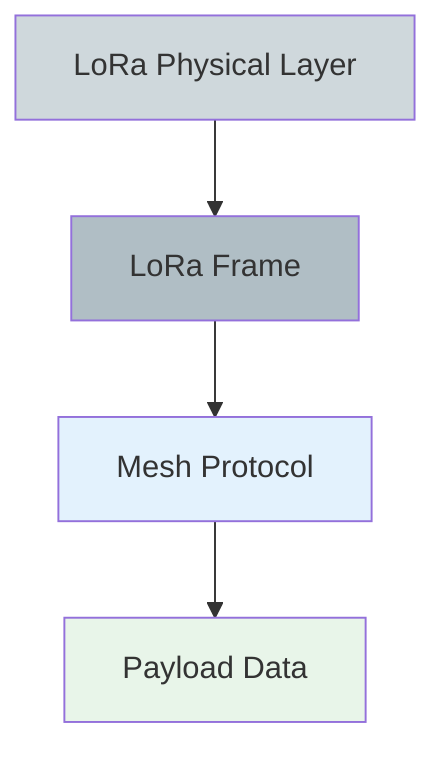
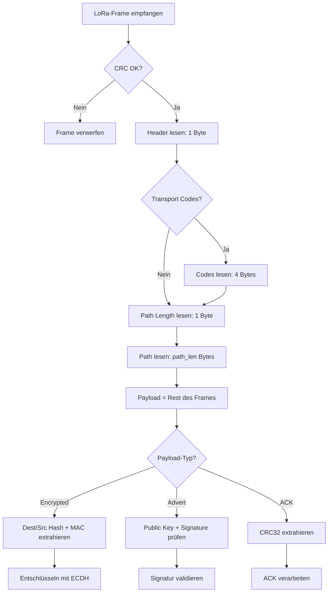
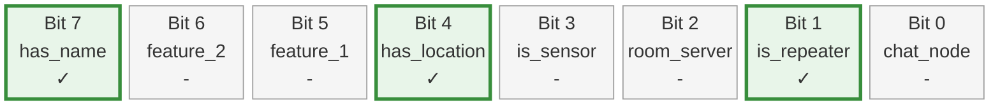

# Paketstruktur

Diese Seite erklärt den Aufbau eines MeshCore-Pakets auf Bit- und Byte-Ebene – vom LoRa-Funkpaket bis zum Mesh-Protokoll.

## Zwei Schichten: LoRa vs. Mesh

Ein MeshCore-Paket besteht aus zwei ineinander geschachtelten Protokoll-Schichten:



### 1. LoRa Physical Layer

Der LoRa-Chip (z.B. SX1262, SX1276, LLCC68) fügt automatisch hinzu:

| Komponente | Größe | Hinzugefügt von | Beschreibung |
|------------|-------|-----------------|--------------|
| **Preamble** | konfigurierbar | LoRa-Chip | Synchronisation der Empfänger |
| **LoRa Header** | 0-20 Bits | LoRa-Chip | Explicit/Implicit Mode, Coding Rate |
| **Payload** | variabel | Firmware | Das Mesh-Paket (siehe unten) |
| **CRC-16** | 2 Bytes | LoRa-Chip | Hardware-Checksumme über Payload |

:::tip LoRa-CRC wird automatisch validiert
Der LoRa-Chip prüft die CRC-16 automatisch. Nur fehlerfreie Pakete werden an die Firmware übergeben. `setCRC(1)` aktiviert dies in der Firmware.
:::

### 2. Mesh Protocol Layer

Das Mesh-Paket **innerhalb** des LoRa-Payloads:


## Header-Byte

Der Header kodiert drei Werte in einem einzigen Byte:


**Bit-Layout:**

```
Bit:  7   6   5   4   3   2   1   0
    ┌───┬───┬───┬───┬───┬───┬───┬───┐
    │Ver│Ver│       Type    │RT │RT │
    └───┴───┴───┴───┴───┴───┴───┴───┘
      └─┬─┘   └──────┬──────┘  └─┬─┘
   Version        Payload      Route
   (2 Bits)        Type         Type
                 (4 Bits)     (2 Bits)
```

**Route Type (Bits 0–1):**

| Wert | Bedeutung |
|------|-----------|
| `0x00` | FLOOD — Transport Codes aktiv (Regionen) |
| `0x01` | FLOOD |
| `0x02` | DIRECT |
| `0x03` | DIRECT — Transport Codes aktiv (Regionen) |

**Payload Type (Bits 2–5):**

| Wert | Typ |
|------|-----|
| `0x01` | RAW_DATA |
| `0x02` | TXT_MSG |
| `0x03` | ACK |
| `0x04` | ADVERT |
| `0x06` | PATH |

**Kodierung:**
```cpp
header = (route_type & 0x03)           // Bits 0-1
       | ((payload_type & 0x0F) << 2)  // Bits 2-5
       | ((version & 0x03) << 6);      // Bits 6-7
```

## Path-Feld


Jede Repeater-ID ist das **erste Byte des Public Keys** des jeweiligen Repeaters. Das ergibt maximal 254 mögliche IDs — Kollisionen sind wahrscheinlich und eingeplant (siehe [Repeater-IDs](routing.md#repeater-ids)).

## Transport Codes (Regionen-Filter)

Transport Codes sind **2 × 2 Bytes** unmittelbar nach dem Header und werden nur genutzt, wenn Route Type `0x00` (FLOOD) oder `0x03` (DIRECT) gesetzt ist. Sie definieren einen **Regionen-Filter**: Nur Repeater, die zur angegebenen Region gehören, leiten das Paket weiter.

:::info
Transport Codes sind optional. Ohne Regionen-Filter wird Route Type `0x01` (FLOOD) oder `0x02` (DIRECT) verwendet und das Feld entfällt komplett.
:::

## Payload-Formate


### ADVERT (0x04) — Broadcast, unverschlüsselt

| Feld | Größe | Beschreibung |
|------|-------|--------------|
| Public Key | 32 Bytes | Ed25519 Public Key (Node-Identität) |
| Timestamp | 4 Bytes | Unix-Zeit (Little Endian) |
| Signature | 64 Bytes | Ed25519-Signatur über (PubKey + Timestamp + AppData) |
| App Data | variabel | Flags + ggf. Position + Name |

### TXT_MSG (0x02) — Private Nachricht, verschlüsselt

| Feld | Größe | Beschreibung |
|------|-------|--------------|
| Dest ID | 1 Byte | Erstes Byte des Public Keys des Empfängers |
| Src ID | 1 Byte | Erstes Byte des Public Keys des Senders |
| MAC | 2 Bytes | Message Authentication Code |
| Ciphertext | variabel | ECDH-verschlüsselt: Timestamp (4B) + Type (1B) + Nachricht |

### ACK (0x03) — Empfangsbestätigung

| Feld | Größe | Beschreibung |
|------|-------|--------------|
| Dest ID | 1 Byte | Empfänger |
| Src ID | 1 Byte | Sender |
| CRC32 | 4 Bytes | Prüfsumme der bestätigten Nachricht |
| SNR Info | optional | Signalstärke-Information |

### PATH (0x06) — Pfad-Lernen

| Feld | Größe | Beschreibung |
|------|-------|--------------|
| Dest ID | 1 Byte | Empfänger |
| Src ID | 1 Byte | Sender |
| Gelernter Pfad | variabel | Repeater-IDs (je 1 Byte) |
| ACK | optional | Eingebettetes ACK bei Antwort |

## Maximale Frame-Größe

**Konstanten** (aus `MeshCore.h`):
```cpp
#define MAX_PATH_SIZE        64
#define MAX_PACKET_PAYLOAD  184
#define MAX_TRANS_UNIT      255
```

**Berechnung:**
```
Ohne Transport Codes:
  1 (Header) + 1 (Path Len) + 64 (Path) + 184 (Payload) = 250 Bytes ✅

Mit Transport Codes:
  1 (Header) + 4 (Codes) + 1 (Path Len) + 64 (Path) + 184 (Payload) = 254 Bytes ✅
```

:::info Keine explizite Payload-Länge
Das Mesh-Protokoll speichert **keine** Payload-Länge. Sie wird implizit berechnet:
```
payload_len = total_frame_len - header_size - transport_codes_size - 1 - path_len
```
:::

## Warum keine Mesh-CRC?

Das Mesh-Protokoll hat **keine eigene Checksumme**, weil:

1. **LoRa-Hardware-CRC** ist bereits aktiv (`setCRC(1)`)
2. LoRa-CRC-16 ist sehr zuverlässig (Hamming-Distanz)
3. Nur CRC-valide Frames werden an Firmware übergeben
4. Zusätzliche CRC wäre redundant

## Frame-Parsing-Ablauf



## Beispiele

### Beispiel 1: Advertisement eines Repeaters

Ein Repeater in Bonn-Hardtberg sendet ein Advertisement (FLOOD-Routing):

**Vollständiger Frame (131 Bytes):**
```
1100FE5616140E71B9E01E5DA75103F56550FFFD78C7DE35CEB30161401CD3A155990B7C5F69FC2DE8FE34DE983DED22BD24A7866A258D823DA714654926A9EDEB54C23EFD990FF25FB22C2B74E0C30177AEB7635CC5CB03CA65BD59A407B891F976FE883D0C9232D1050372946B00442D424E2D353331323320486172647462657267
```

**Hex-Breakdown mit Byte-Positionen:**

| Bytes | Feld | Hex-Wert |
|-------|------|----------|
| **0** | Header | `11` |
| **1** | Path Length | `00` |
| **2-33** | Public Key | `FE5616140E71B9E01E5DA75103F56550FFFD78C7DE35CEB30161401CD3A15599` |
| **34-37** | Timestamp | `0B7C5F69` |
| **38-101** | Signature | `FC2DE8FE34DE983DED22BD24A7866A258D823DA714654926A9EDEB54C23EFD990FF25FB22C2B74E0C30177AEB7635CC5CB03CA65BD59A407B891F976FE883D0C` |
| **102** | App Flags | `92` |
| **103-106** | Latitude | `32D10503` |
| **107-110** | Longitude | `72946B00` |
| **111-130** | Node Name | `442D424E2D353331323320486172647462657267` |

**Dekodierte Werte:**

| Feld | Roh-Wert | Dekodiert |
|------|----------|-----------|
| **Header** | `0x11` = `00010001` | Version 0 + ADVERT (0x04) + FLOOD (0x01) |
| **Path Length** | `0x00` | 0 Bytes (kein Pfad bei FLOOD) |
| **Public Key** | 32 Bytes | Ed25519 Public Key (Node-Identität) |
| **Timestamp** | `0B7C5F69` (LE) | **1767865355** = **2026-01-08 09:42:35 UTC** |
| **Signature** | 64 Bytes | Ed25519-Signatur über (PubKey + Timestamp + AppData) |
| **App Flags** | `0x92` = `10010010` | Repeater ✓, Location ✓, Name ✓ |
| **Latitude** | `32D10503` (LE) | **50712882** → **50.712882° N** |
| **Longitude** | `72946B00` (LE) | **7050354** → **7.050354° E** |
| **Node Name** | ASCII-Hex | **"D-BN-53123 Hardtberg"** (20 Zeichen) |

**Header-Bit-Dekodierung** (`0x11` = `00010001`):

```
  0  0  0  1  0  0  0  1
 [0  0][0  1  0  0][0  1]
 Ver=0  Type=4      RT=1
        ADVERT      FLOOD
```

**App Data Flags (0x92 = 10010010 binär):**



**Visualisierung im MeshCore Analyzer:**


### Beispiel 2: Text Message "Hallo Ulli!"

Eine verschlüsselte Textnachricht, direkt ohne Hops zugestellt:

**Vollständiger Frame (22 Bytes):**
```
0A004F37CD40E201D82228058A434BF27B926B6F43F7
```

**Hex-Breakdown mit Byte-Positionen:**

| Bytes | Feld | Hex-Wert |
|-------|------|----------|
| **0** | Header | `0A` |
| **1** | Path Length | `00` |
| **2** | Dest Hash | `4F` |
| **3** | Source Hash | `37` |
| **4-5** | MAC | `CD40` |
| **6-21** | Ciphertext | `E201D82228058A434BF27B926B6F43F7` |

**Dekodierte Werte:**

| Feld | Roh-Wert | Dekodiert |
|------|----------|-----------|
| **Header** | `0x0A` = `00001010` | Version 0 + TXT_MSG (0x02) + DIRECT (0x02) |
| **Path Length** | `0x00` | 0 Bytes (direkte Verbindung ohne Repeater) |
| **Dest Hash** | `0x4F` | Empfänger: Ulli (erstes Byte des Public Keys) |
| **Source Hash** | `0x37` | Sender (erstes Byte des Public Keys) |
| **MAC** | `0xCD40` | Message Authentication Code (2 Bytes) |
| **Ciphertext** | 16 Bytes | Verschlüsselt: Timestamp + Type + "Hallo Ulli!" |

**Header-Bit-Dekodierung** (`0x0A` = `00001010`):

```
  0  0  0  0  1  0  1  0
 [0  0][0  0  1  0][1  0]
 Ver=0  Type=2      RT=2
        TXT_MSG     DIRECT
```

**Visualisierung im MeshCore Analyzer:**


## Zusammenfassung

| Aspekt | Wert |
|--------|------|
| **Minimale Frame-Größe** | 2 Bytes (Header + Path-Len=0) |
| **Maximale Frame-Größe** | 254 Bytes (mit Transport Codes) |
| **Checksumme** | LoRa-Hardware-CRC-16 (automatisch) |
| **Längenbestimmung** | Implizit: `payload_len = total - overhead` |
| **Header-Größe** | 1 Byte (Route Type, Payload Type, Version) |
| **Optionale Felder** | Transport Codes (4 Bytes, Regionen-Filter), Path (0-64 Bytes) |

:::tip Wire-Format ist kompakt
MeshCore nutzt jeden Byte effizient: Keine Padding-Bytes, keine redundanten Längenfelder, keine doppelte Checksumme.
:::
