# Paketstruktur

Diese Seite erklärt den Aufbau eines MeshCore-Pakets auf Bit- und Byte-Ebene – vom LoRa-Funkpaket bis zum Mesh-Protokoll.

## Zwei Schichten: LoRa vs. Mesh

Ein MeshCore-Paket besteht aus zwei ineinander geschachtelten Protokoll-Schichten:

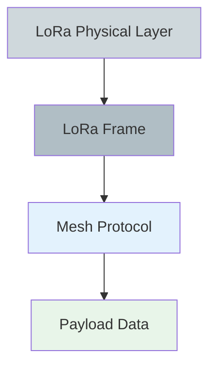

### 1. LoRa Physical Layer

Der LoRa-Chip (z.B. SX1262, SX1276, LLCC68) fügt automatisch hinzu:

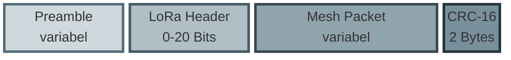

| Komponente | Größe | Hinzugefügt von | Beschreibung |
|------------|-------|-----------------|--------------|
| **Preamble** | konfigurierbar | LoRa-Chip | Synchronisation der Empfänger |
| **LoRa Header** | 0-20 Bits | LoRa-Chip | Explicit/Implicit Mode, Coding Rate |
| **Payload** | variabel | Firmware | Das Mesh-Paket (siehe unten) |
| **CRC-16** | 2 Bytes | LoRa-Chip | Hardware-Checksumme über Payload |

:::tip LoRa-CRC wird automatisch validiert
Der LoRa-Chip prüft die CRC-16 automatisch. Nur fehlerfreie Pakete werden an die Firmware übergeben. `setCRC(1)` aktiviert dies in der Firmware.
:::

### 2. Mesh Protocol Layer

Das Mesh-Paket **innerhalb** des LoRa-Payloads hat folgende Struktur:

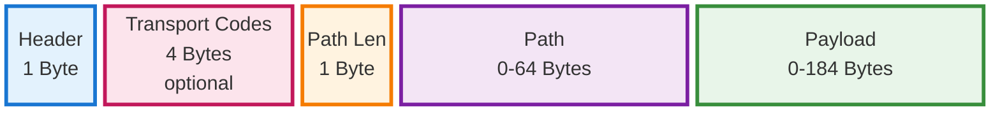

## Detaillierte Frame-Struktur

### Minimales Frame (ohne Transport Codes, ohne Path)

**Frame-Struktur:**

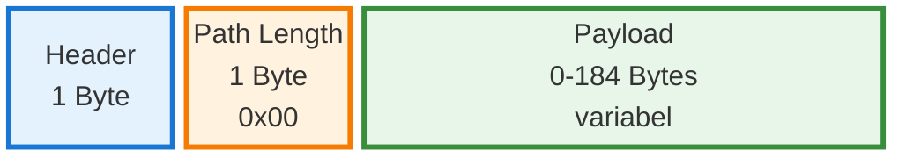

**Header-Byte im Detail:**

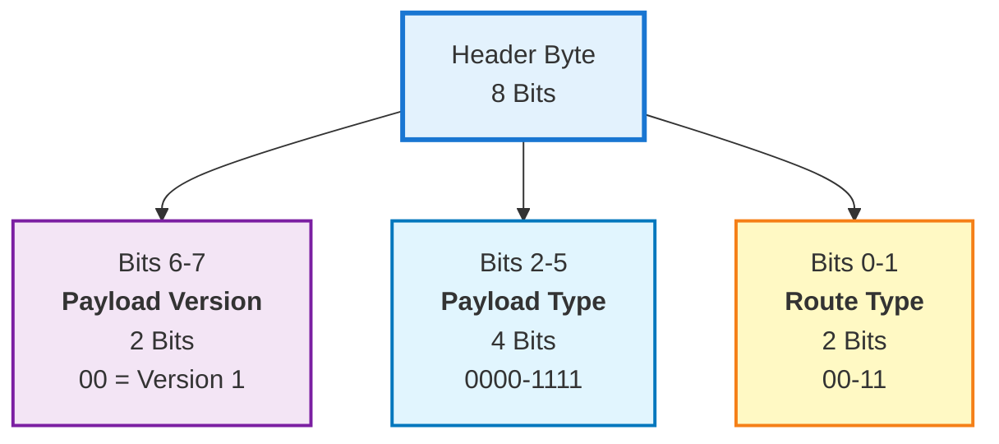

**Bit-Layout:**

```
 Bit:  7   6   5   4   3   2   1   0
     ┌───┬───┬───┬───┬───┬───┬───┬───┐
     │Ver│Ver│ Type  │ Type  │RT │RT │
     └───┴───┴───┴───┴───┴───┴───┴───┘
       └─┬─┘   └────┬────┘   └──┬──┘
    Payload      Payload      Route
    Version       Type         Type
    (2 Bits)     (4 Bits)    (2 Bits)
```

**Gesamtlänge in Bytes**: 2 + Payload-Länge

### Vollständiges Frame (mit Transport Codes und Path)

**Frame-Struktur:**

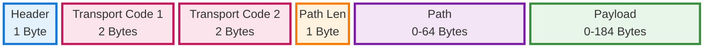

**Beispiel mit 3 Hops:**

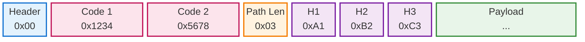

**Beispiel-Bytes:**
```
Byte  0:    Header
Byte  1-2:  Transport Code 1 (16-bit, Little Endian)
Byte  3-4:  Transport Code 2 (16-bit, Little Endian)
Byte  5:    Path Length (z.B. 0x03 für 3 Hops)
Byte  6-8:  Path (3 Node-Hashes à 1 Byte)
Byte  9+:   Payload
```

**Gesamtlänge in Bytes**: 6 + Path-Länge + Payload-Länge

## Längenbestimmung

:::info Keine explizite Payload-Länge
Das Mesh-Protokoll speichert **keine** explizite Payload-Länge. Diese wird implizit berechnet.
:::

**Formel**:
```
payload_len = total_frame_len - header_size - transport_codes_size - 1 - path_len
```

## Beispiele

### Beispiel 1: Advertisement eines Repeaters

Ein Repeater in Bonn-Hardtberg sendet ein Advertisement (FLOOD-Routing):

**Vollständiger Frame (131 Bytes):**
```
1100FE5616140E71B9E01E5DA75103F56550FFFD78C7DE35CEB30161401CD3A155990B7C5F69FC2DE8FE34DE983DED22BD24A7866A258D823DA714654926A9EDEB54C23EFD990FF25FB22C2B74E0C30177AEB7635CC5CB03CA65BD59A407B891F976FE883D0C9232D1050372946B00442D424E2D353331323320486172647462657267
```

**Farbige Byte-Range-Übersicht:**

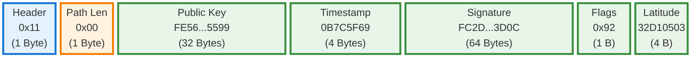

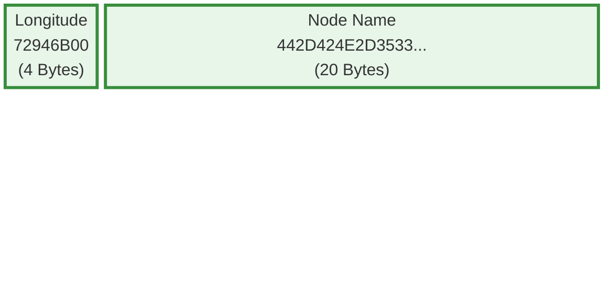

**Hex-Breakdown mit Byte-Positionen:**

| Bytes | Feld | Hex-Wert |
|-------|------|----------|
| **0** | Header | `11` |
| **1** | Path Length | `00` |
| **2-33** | Public Key | `FE5616140E71B9E01E5DA75103F56550FFFD78C7DE35CEB30161401CD3A15599` |
| **34-37** | Timestamp | `0B7C5F69` |
| **38-101** | Signature | `FC2DE8FE34DE983DED22BD24A7866A258D823DA714654926A9EDEB54C23EFD990FF25FB22C2B74E0C30177AEB7635CC5CB03CA65BD59A407B891F976FE883D0C` |
| **102** | App Flags | `92` |
| **103-106** | Latitude | `32D10503` |
| **107-110** | Longitude | `72946B00` |
| **111-130** | Node Name | `442D424E2D353331323320486172647462657267` |

**Dekodierte Werte:**

| Feld | Roh-Wert | Dekodiert |
|------|----------|-----------|
| **Header** | `0x11` | FLOOD (0x01) + ADVERT (0x04) + Version 1 |
| **Path Length** | `0x00` | 0 Bytes (kein Pfad bei FLOOD) |
| **Public Key** | 32 Bytes | Ed25519 Public Key (Node-Identität) |
| **Timestamp** | `0B7C5F69` (LE) | **1767865355** = **2026-01-08 09:42:35 UTC** |
| **Signature** | 64 Bytes | Ed25519-Signatur über (PubKey + Timestamp + AppData) |
| **App Flags** | `0x92` = `10010010` | Repeater ✓, Location ✓, Name ✓ |
| **Latitude** | `32D10503` (LE) | **50712882** → **50.712882° N** |
| **Longitude** | `72946B00` (LE) | **7050354** → **7.050354° E** |
| **Node Name** | ASCII-Hex | **"D-BN-53123 Hardtberg"** (20 Zeichen) |

**Header-Bit-Dekodierung:**

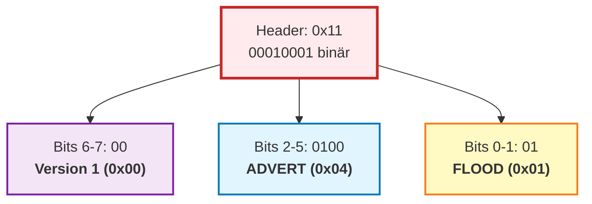

**App Data Flags (0x92 = 10010010 binär):**

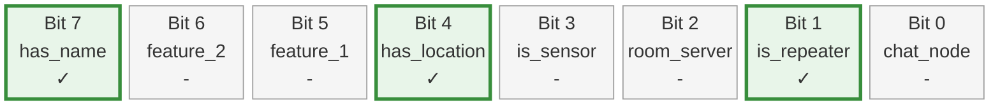

**Standort:**
- **Koordinaten**: 50.712882°N, 7.050354°E
- **Ort**: Bonn-Hardtberg, Deutschland (Rheinland)
- **Postleitzahl**: D-BN-53123
- **Node-Typ**: Repeater mit GPS und Name

**Visualisierung im MeshCore Analyzer:**


*Dieser Screenshot zeigt die detaillierte Paket-Analyse mit Byte-für-Byte-Breakdown und farbcodierter Darstellung aller Felder.*

### Beispiel 2: Text Message "Hallo Ulli!"

Eine echte Textnachricht an Ulli mit dem Inhalt "Hallo Ulli!" direkt übermittelt ohne Hops:

**Vollständiger Frame (22 Bytes):**
```
0A004F37CD40E201D82228058A434BF27B926B6F43F7
```

**Farbige Byte-Range-Übersicht:**

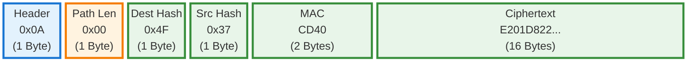

**Hex-Breakdown mit Byte-Positionen:**

| Bytes | Feld | Hex-Wert |
|-------|------|----------|
| **0** | Header | `0A` |
| **1** | Path Length | `00` |
| **2** | Dest Hash | `4F` |
| **3** | Source Hash | `37` |
| **4-5** | MAC | `CD40` |
| **6-21** | Ciphertext | `E201D82228058A434BF27B926B6F43F7` |

**Dekodierte Werte:**

| Feld | Roh-Wert | Dekodiert |
|------|----------|-----------|
| **Header** | `0x0A` | DIRECT (0x02) + TEXT_MSG (0x02) + Version 1 |
| **Path Length** | `0x00` | 0 Bytes (keine Repeater, direkte Verbindung) |
| **Dest Hash** | `0x4F` | Empfänger: Ulli (Hash von Public Key) |
| **Source Hash** | `0x37` | Sender (Hash von Public Key) |
| **MAC** | `0xCD40` | Message Authentication Code (2 Bytes) |
| **Ciphertext** | 16 Bytes | Verschlüsselt: Timestamp + Type + "Hallo Ulli!" |

**Header-Bit-Dekodierung:**

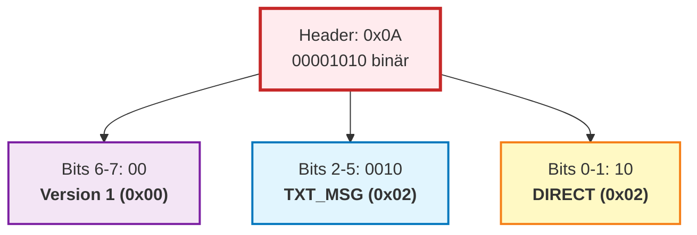

**Struktur nach Entschlüsselung:**

Nach Entschlüsselung mit ECDH (Ed25519) enthält der Ciphertext:


**Nachricht:**
- **Text**: "Hallo Ulli!" (UTF-8, 11 Bytes)
- **Type**: 0x00 = Plain Text
- **Attempt**: 0 (erste Übertragung)

**Besonderheiten:**
- **Path Length = 0**: Direkte Punkt-zu-Punkt-Verbindung ohne Repeater
- **DIRECT Routing**: Verwendet vorher gelernten Pfad (in diesem Fall leer = lokale Kommunikation)
- **Verschlüsselung**: ECDH mit Ed25519-Schlüsseln, nur Empfänger kann entschlüsseln

**Visualisierung im MeshCore Analyzer:**


*Dieser Screenshot zeigt die Textnachricht "Hallo Ulli!" mit vollständiger Frame-Dekodierung und verschlüsseltem Payload.*

## Maximale Frame-Größe

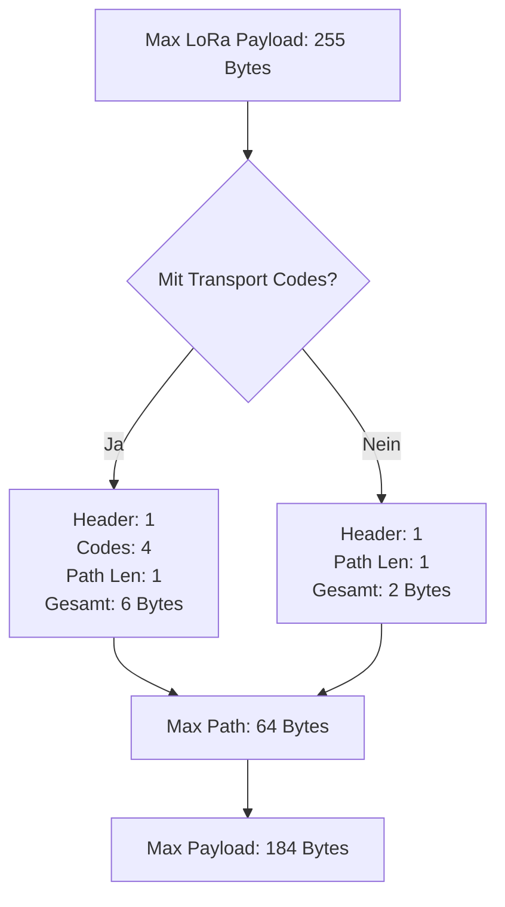

**Konstanten** (aus `MeshCore.h`):
```cpp
#define MAX_PATH_SIZE        64
#define MAX_PACKET_PAYLOAD  184
#define MAX_TRANS_UNIT      255
```

**Berechnung**:
```
Ohne Transport Codes:
  1 (Header) + 1 (Path Len) + 64 (Path) + 184 (Payload) = 250 Bytes ✅

Mit Transport Codes:
  1 (Header) + 4 (Codes) + 1 (Path Len) + 64 (Path) + 184 (Payload) = 254 Bytes ✅
```

## Checksumme / CRC

### Warum keine Mesh-CRC?

Das Mesh-Protokoll hat **keine eigene Checksumme**, weil:

1. **LoRa-Hardware-CRC** ist bereits aktiv (`setCRC(1)`)
2. LoRa-CRC-16 ist sehr zuverlässig (Hamming-Distanz)
3. Nur CRC-valide Frames werden an Firmware übergeben
4. Zusätzliche CRC wäre redundant

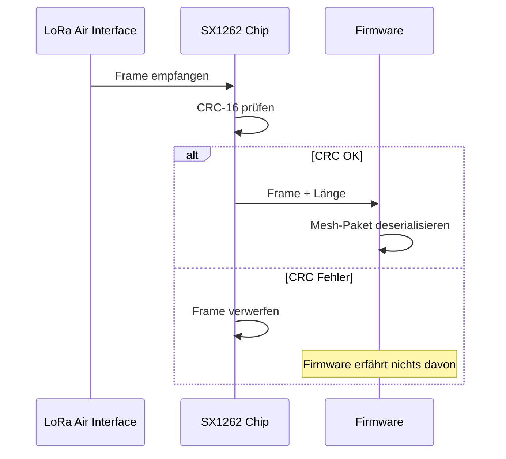

## Frame-Parsing-Ablauf

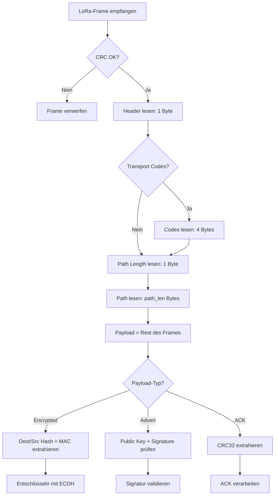

## Header-Bit-Dekodierung

Der Header (1 Byte) kodiert drei Werte:

```
Bit:     7  6  5  4  3  2  1  0
         [Ver ][  Type  ][ RT ]

RT   = Route Type (2 Bits)
Type = Payload Type (4 Bits)
Ver  = Payload Version (2 Bits)
```

**Beispiel**: Header = `0x0A` (binär: `00001010`)

```
  0  0  0  0  1  0  1  0
 [0  0][0  1  0  0][1  0]
 Ver=0  Type=4     RT=2
```

- Route Type: `10` = DIRECT (0x02)
- Payload Type: `0100` = ADVERT (0x04)
- Version: `00` = Version 1 (0x00)

**Umgekehrt kodieren**:

```cpp
header = (route_type & 0x03)           // Bits 0-1
       | ((payload_type & 0x0F) << 2)  // Bits 2-5
       | ((version & 0x03) << 6);      // Bits 6-7
```

## Zusammenfassung

| Aspekt | Wert |
|--------|------|
| **Minimale Frame-Größe** | 2 Bytes (Header + Path-Len=0 + leere Payload) |
| **Maximale Frame-Größe** | 254 Bytes (mit Transport Codes) |
| **Checksumme** | LoRa-Hardware-CRC-16 (automatisch) |
| **Längenbestimmung** | Implizit: `payload_len = total - overhead` |
| **Header-Größe** | 1 Byte (Route, Type, Version) |
| **Optionale Felder** | Transport Codes (4 Bytes), Path (0-64 Bytes) |

:::tip Wire-Format ist kompakt
MeshCore nutzt jeden Byte effizient: Keine Padding-Bytes, keine redundanten Längenfelder, keine doppelte Checksumme.
:::
