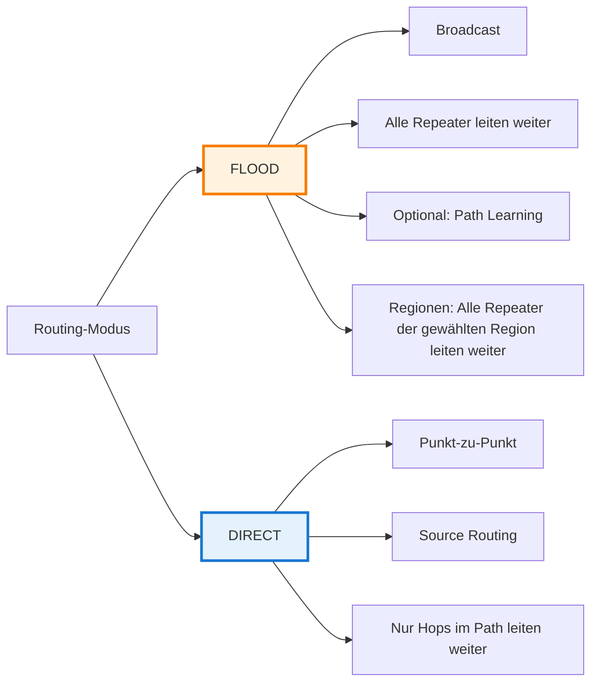
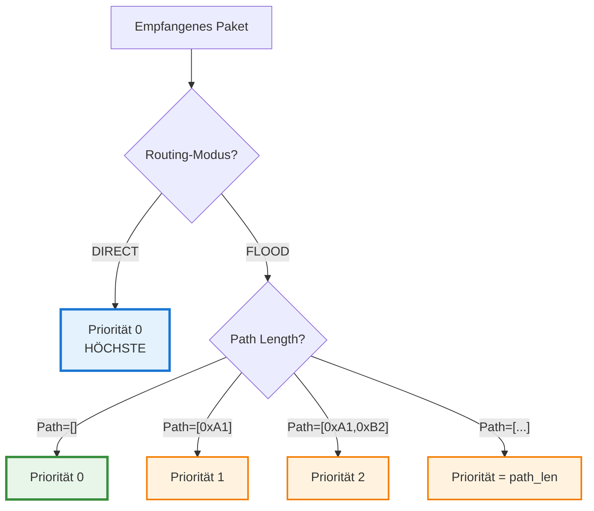
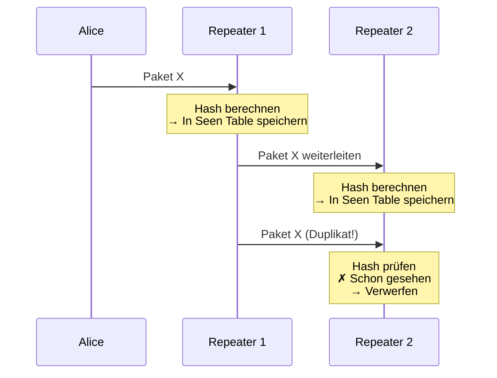
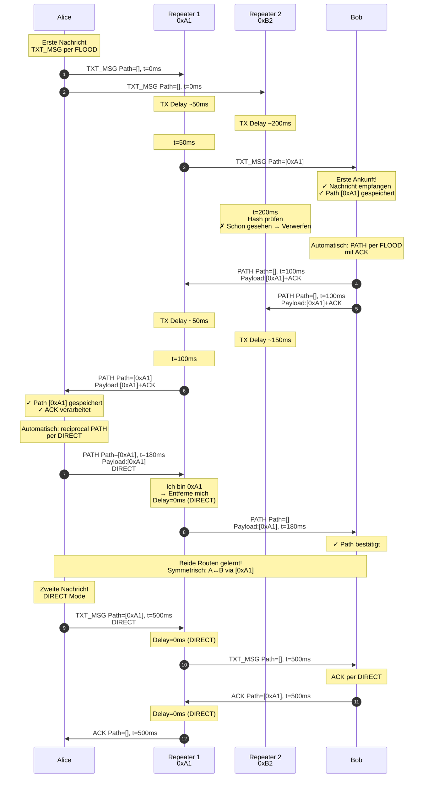

# Routing

Diese Seite erklärt, wie MeshCore-Repeater Nachrichten weiterleiten, wie Flooding funktioniert und welche Rolle Timing dabei spielt.

## Zwei Routing-Modi

MeshCore kennt zwei grundlegende Routing-Modi:



| Modus | Beschreibung | Wann? |
|-------|--------------|-------|
| **FLOOD** | Broadcast an alle Repeater, alle leiten weiter | **Öffentliche Kanalnachrichten** (immer FLOOD) oder **erste private Nachricht** (Path Learning) |
| **DIRECT** | Source Routing über vorgegebenen Pfad | **Private Nachrichten** mit bekanntem Pfad |

- **Öffentliche Kanalnachrichten**: FLOOD ohne Path Learning (kein PATH-Paket zurück)
- **Private Nachrichten**: FLOOD mit Path Learning (PATH-Paket zurück, beide Richtungen lernen)

## FLOOD-Routing: Schritt für Schritt

:::info Zwei Anwendungsfälle für FLOOD
FLOOD wird für zwei verschiedene Zwecke verwendet:
1. **Öffentliche Kanalnachrichten**: Broadcast an alle Teilnehmer, **kein** Path Learning
2. **Private Nachrichten** (erste Nachricht): Path Learning für effiziente Folge-Kommunikation

Die folgenden Schritte beschreiben FLOOD-Routing am **Beispiel einer privaten Nachricht mit Path Learning** (Anwendungsfall 2). Öffentliche Kanalnachrichten (Anwendungsfall 1) nutzen denselben FLOOD-Mechanismus für die Schritte 1-4, aber ohne Path-Learning (Schritt 5).
:::

### 1. Initiales Senden

Alice sendet ihre erste private Nachricht an Bob. Der Pfad ist noch unbekannt — das Paket startet mit leerem Path.


### 2. Repeater empfangen und fügen sich zum Path hinzu

Jeder Repeater, der das Paket empfängt:
1. Prüft: "Habe ich dieses Paket schon gesehen?" (Duplicate Detection)
2. Wenn nein: Hängt eigene ID an den Path an
3. Plant Weiterleitung mit RX Delay (SNR-basiert) + TX Delay (random)


### 3. Weiterleitung mit aufgebautem Path

R1 hat den kürzeren Delay (besseres SNR) und sendet als Erster. R2 wartet noch. R3 empfängt von R1 und hängt sich ebenfalls an.


### 4. Empfänger erhält Pakete über verschiedene Wege

Bob empfängt von R1 als Erstem (bestes SNR, kürzester Delay) — **First Packet Wins**:


- Paket 1: Path = `[0xA1]` (direkt über Repeater 1) ← **Gewinnt!**
- Paket 2: Path = `[0xB2]` (direkt über Repeater 2) → Verworfen als Duplikat
- Paket 3: Path = `[0xA1, 0xC3]` (über R1 → R3) → Verworfen als Duplikat


Bob akzeptiert **nur das erste empfangene Paket**. Alle anderen werden als Duplikate verworfen.

**Frame-Wachstum bei FLOOD** — PathLen nimmt mit jedem Hop zu:

```
Alice:  [H][0][Payload]              → 2 + Payload Bytes
    ↓ R1 hängt sich an
R1:     [H][1][A1][Payload]          → 3 + Payload Bytes
    ↓ R3 hängt sich an
R3:     [H][2][A1][C3][Payload]      → 4 + Payload Bytes
    ↓
Bob empfängt!
```

### 5. Automatischer bidirektionaler Path-Learning

Nach dem Empfang einer FLOOD-Nachricht startet ein automatischer Prozess, der **beide Routen gleichzeitig lernt**:

:::warning Payload vs. Path-Header
Im PATH-Paket sind zwei verschiedene Routing-Informationen enthalten:
- **Path-Header** (wächst beim FLOOD): der Reise-Pfad, den *dieses* Paket genommen hat
- **Payload**: die explizite Route, die der Empfänger für zukünftige DIRECT-Nachrichten nutzen soll

Path-Learning nutzt den **Payload** — nicht den Path-Header!
:::


**Der Ablauf im Detail:**

1. **Bob empfängt TXT_MSG per FLOOD** mit Path=`[0xA1]` (erstes angekommenes Paket)
2. **Bob legt `[0xA1]` in den Payload** des PATH-Pakets ab: "Alice, nutze `[0xA1]` um mich zu erreichen"
3. **Bob sendet PATH-Paket per FLOOD**
   - Im Payload: `[0xA1]` (Routing-Info für Alice)
   - Als Extra: ACK für die Nachricht
4. **Alice empfängt PATH per FLOOD**: Path-Header=`[0xB2]` (Reise-Pfad), Payload=`[0xA1]` (Routing-Info)
5. **Alice liest den Payload `[0xA1]`** und speichert out_path=`[0xA1]` (Alice → Bob)
6. **Alice verarbeitet das ACK** im PATH-Paket
7. **Alice sendet automatisch reciprocal PATH per DIRECT**
   - Via Pfad `[0xA1]` (aus dem **Payload** des empfangenen PATH)
   - Im Payload: `[0xB2]` (der Path-Header des empfangenen PATH = Bobs Reise-Pfad zu Alice)
8. **Bob empfängt PATH per DIRECT** mit Payload=`[0xB2]` und speichert out_path=`[0xB2]` (Bob → Alice)

**Ergebnis nach einer FLOOD-Nachricht:**
- ✅ Alice kennt Pfad zu Bob: `[0xA1]`
- ✅ Bob kennt Pfad zu Alice: `[0xB2]`
- ✅ Beide können DIRECT kommunizieren
- ✅ Routen sind **asymmetrisch** (in diesem Beispiel)

**Wichtig:**
- **Ein FLOOD reicht** für bidirektionales Path-Learning
- Die Routen **können asymmetrisch sein** (abhängig von der Netzwerktopologie)
- Der **Payload des PATH-Pakets** enthält die Route für den Empfänger — nicht der Path-Header
- Kein Problem: Jede Richtung funktioniert unabhängig

## DIRECT-Routing: Source Routing

Nachdem Alice den Pfad zu Bob gelernt hat, verwendet sie DIRECT-Routing. Der Pfad ist im Frame eingebettet und **schrumpft** bei jedem Hop.

![DIRECT Schritt 1: Alice sendet mit gesetztem Pfad [A1, C3]](/img/meshcore/routing/direct-01-alice-sends.svg)

R1 prüft: Steht meine ID vorne im Path?


R1 entfernt sich aus dem Path und leitet weiter. R2 verwirft, da er nicht im Path steht:


R3 ist jetzt vorne im Path — entfernt sich und leitet an Bob weiter:


![DIRECT Schritt 6: Bob empfängt mit Path=[]](/img/meshcore/routing/direct-06-bob-receives.svg)

**Frame-Schrumpfung bei DIRECT** — PathLen nimmt mit jedem Hop ab:

```
Alice:  [H][2][A1][C3][Payload]   → 4 + Payload Bytes
    ↓ R1 entfernt sich
R1:     [H][1][C3][Payload]       → 3 + Payload Bytes
    ↓ R3 entfernt sich
R3:     [H][0][Payload]           → 2 + Payload Bytes
    ↓
Bob empfängt!
```

**Wichtig:**
- Nur der **erste Repeater im Path** leitet weiter
- Alle anderen Repeater verwerfen das Paket
- Der Repeater **entfernt sich selbst** aus dem Path beim Weiterleiten
- Am Ende erhält Bob ein Paket mit leerem Path (`Path=[]`)

## Repeater-IDs

Jeder Repeater ist im Path durch eine **1-Byte-ID** identifiziert.

### Herkunft der ID

Die Repeater-ID ist das **erste Byte des 32-Byte Public Keys**:

```
Public Key:  FE 56 16 14 0E 71 B9 E0 1E 5D A7 51 03 F5 65 50 ...
                ↓
Repeater-ID: 0xFE
```

Das ergibt **254 mögliche IDs** (0x00–0xFF minus reservierte Werte). Kollisionen sind wahrscheinlich und bewusst eingeplant.

### Warum nur 1 Byte?

Airtime ist die wertvollste Ressource im Mesh:

| | 1-Byte-ID | 2-Byte-ID (hypothetisch) |
|---|---|---|
| **Path bei 64 Hops** | 64 × 1 = **64 Bytes** | 64 × 2 = **128 Bytes** |
| **Max. Payload** | **184 Bytes** | ~120 Bytes |
| **Airtime** | optimal | +50% länger |

### Verhalten bei Kollisionen

Wenn zwei Repeater dieselbe 1-Byte-ID haben:

| | Auswirkung |
|---|---|
| **FLOOD** | Beide leiten weiter — funktioniert korrekt |
| **DIRECT** | Einer oder beide leiten weiter — funktioniert in der Regel |
| **Kryptografie** | Nutzt immer den vollen 32-Byte-Key — keine Sicherheitslücke |
| **App-Anzeige** | Kann "2 known repeaters" zeigen — für Nutzer verwirrend, aber unkritisch |

## Timing & Delays

MeshCore fügt vor dem Weiterleiten ein **zufälliges TX Delay** ein, um Kollisionen zu vermeiden:

### TX Delay (Zufalls-basiert)

Nach der Verarbeitung wird zusätzlich ein **zufälliges Delay** hinzugefügt, bevor das Paket weitergeleitet wird:

```cpp
uint32_t t = airtime * tx_delay_factor;
uint32_t delay = random(0, 5 * t);
```

**Formel:**
```
TX Delay = Zufallszahl(0, 5 × Airtime × tx_delay_factor)
```

**Der `tx_delay_factor` ist konfigurierbar:**
- **Default**: `0.5` (Repeater/Room Server)
- **Bereich**: `0.0 - 2.0`
- **CLI-Kommando**: `set txdelay <wert>`
- **Effekt**: Skaliert den Zufallsbereich, **nicht** ein festes zusätzliches Delay

**Beispiele** (Airtime = 200 ms):

| tx_delay_factor | t | TX Delay Bereich | Zweck |
|-----------------|---|------------------|-------|
| **0.5** (Default) | 100 ms | 0-500 ms | Ausgewogene Kollisionsvermeidung |
| **0.25** | 50 ms | 0-250 ms | Geringeres Delay, mehr Kollisionen |
| **1.0** | 200 ms | 0-1000 ms | Höheres Delay, weniger Kollisionen |
| **0.0** | 0 ms | 0 ms | TX Delay deaktiviert (nicht empfohlen) |

:::info Anpassung des TX Delay
Ein höherer `tx_delay_factor` vergrößert den Zufallsbereich und reduziert Kollisionen, erhöht aber die Latenz. Der Default-Wert `0.5` ist für die meisten Netzwerke optimal.
:::

### TX Delay bei DIRECT

Bei DIRECT-Routing wird ebenfalls ein TX Delay verwendet, allerdings mit einem **kleineren Faktor**:

```cpp
uint32_t t = airtime * direct_tx_delay_factor;
uint32_t delay = random(0, 5 * t);
```

**Der `direct_tx_delay_factor` ist konfigurierbar:**
- **Default**: `0.2` (Repeater/Room Server/Sensor)
- **Bereich**: `0.0 - 2.0`
- **CLI-Kommando**: `set direct.txdelay <wert>`

**Beispiele** (Airtime = 200 ms):

| direct_tx_delay_factor | t | DIRECT TX Delay | Zweck |
|------------------------|---|-----------------|-------|
| **0.2** (Default) | 40 ms | 0-200 ms | Geringe Kollisionsvermeidung |
| **0.0** | 0 ms | 0 ms | Keine Verzögerung (minimale Latenz) |
| **0.5** | 100 ms | 0-500 ms | Wie FLOOD txdelay |

**Vergleich:**

| Routing-Modus | TX Delay | Grund |
|---------------|----------|-------|
| **FLOOD** | 0-500 ms (random) | Kollisionsvermeidung |
| **DIRECT** | 0-200 ms (random) | Geringe Kollisionsvermeidung, niedrige Latenz |

*Bei den jeweiligen Default-Faktoren und 200 ms Airtime.

## Prioritäten

MeshCore vergibt **Prioritäten** bei der Weiterleitung:



**Regel:**
```cpp
priority = path_len  // bei FLOOD
priority = 0         // bei DIRECT
```

**Bedeutung:**
- **Kürzere Pfade** = höhere Priorität (werden zuerst gesendet)
- **DIRECT** = immer höchste Priorität
- Verhindert, dass weit entfernte Repeater den Kanal blockieren

## Duplicate Detection

Jeder Repeater speichert empfangene Pakete in einer **Seen Table**:



**Hash-Berechnung:**
```cpp
SHA256(payload_type + payload_len + payload)
```

**Wichtig:**
- Der Hash berücksichtigt **nicht** den Path
- Dasselbe Paket über verschiedene Wege hat denselben Hash
- Verhindert Endlos-Schleifen im Mesh

## Vollständiges FLOOD-Beispiel

Kompletter Nachrichtenfluss mit Timing und bidirektionalem Path-Learning:



## Zusammenfassung

| Aspekt | FLOOD | DIRECT |
|--------|-------|--------|
| **Zweck** | Broadcast (Öffentlich) oder Path Learning (Privat) | Effiziente Punkt-zu-Punkt-Zustellung |
| **Path** | Wächst (jeder Hop hängt sich an) | Schrumpft (jeder Hop entfernt sich) |
| **Weiterleitung** | Alle Repeater | Nur Hops im Path |
| **TX Delay** | 0-500 ms (random, konfigurierbar)* | 0-200 ms (random, konfigurierbar)** |
| **Priorität** | path_len | 0 (höchste) |
| **Duplikate** | Viele (über verschiedene Wege) | Keine |
| **Airtime** | Hoch | Niedrig |
| **Anwendung** | Öffentliche Kanäle (immer) + erste private Nachricht | Folgende private Nachrichten |

*TX Delay: `tx_delay_factor` (Default: `0.5`)
**DIRECT TX Delay: `direct_tx_delay_factor` (Default: `0.2`, ergibt 0-200ms bei 200ms Airtime)

**Best Practice:**

**Öffentliche Kanalnachrichten:**
- Immer FLOOD-Modus (kein Path Learning möglich)
- Keine PATH-Pakete zurück
- Alle Teilnehmer empfangen die Nachricht

**Private Nachrichten:**
- Erste Nachricht: FLOOD (beide Richtungen lernen)
- Folgende Nachrichten: DIRECT (effizient)
- Nach ~180ms: Beide Pfade gelernt, DIRECT-Kommunikation möglich (bei guten Signalen)

**Allgemein:**
- Repeater ignorieren Duplikate automatisch
- "First Packet Wins" bei mehreren Pfaden
- Asymmetrische Routen sind normal und funktionieren

**Bidirektionales Path-Learning (nur private Nachrichten):**
- **Eine FLOOD-Nachricht** vom Sender löst automatischen Prozess aus
- Empfänger sendet automatisch PATH per FLOOD zurück
- Sender sendet automatisch reciprocal PATH per DIRECT
- **Gesamt: 2× FLOOD (hin & zurück) + 1× DIRECT**
- Beide Nodes kennen danach den optimalen Pfad zum anderen

**Hinweis zu asymmetrischen Routen:**
- Alice → Bob könnte über Repeater A gehen
- Bob → Alice könnte über Repeater B gehen
- Beide Richtungen verwenden den jeweils ersten empfangenen Pfad
- Kein Problem, da jeder Knoten seinen eigenen Pfad zur Gegenseite lernt
- Asymmetrische Routen sind ein gültiges und funktionierendes Szenario
