# Routing

Diese Seite erklärt, wie MeshCore-Repeater Nachrichten weiterleiten, wie Flooding funktioniert und welche Rolle Timing dabei spielt.

## Zwei Routing-Modi

MeshCore kennt zwei grundlegende Routing-Modi:

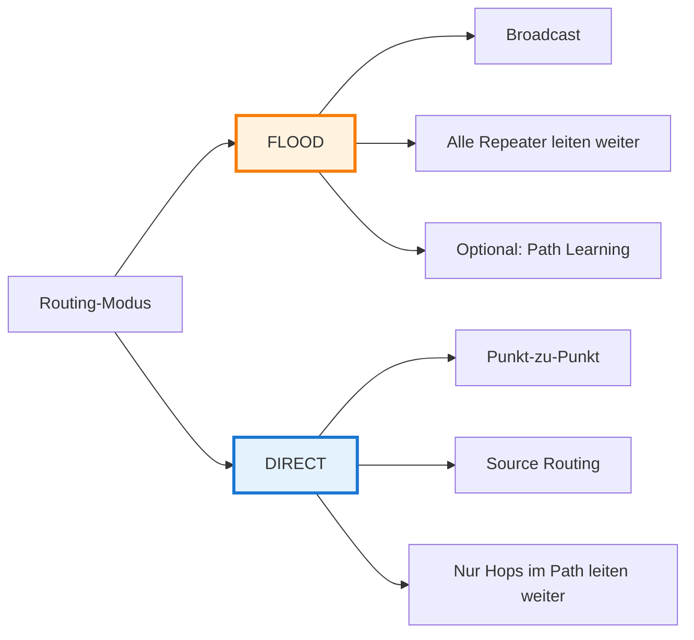

| Modus | Beschreibung | Wann? |
|-------|--------------|-------|
| **FLOOD** | Broadcast an alle Repeater, alle leiten weiter | **Öffentliche Kanalnachrichten** (immer FLOOD) oder **erste private Nachricht** (Path Learning) |
| **DIRECT** | Source Routing über vorgegebenen Pfad | **Private Nachrichten** mit bekanntem Pfad |

- **Öffentliche Kanalnachrichten**: FLOOD ohne Path Learning (kein PATH-Paket zurück)
- **Private Nachrichten**: FLOOD mit Path Learning (PATH-Paket zurück, beide Richtungen lernen)

## FLOOD-Routing: Schritt für Schritt

:::info Zwei Anwendungsfälle für FLOOD
FLOOD wird für zwei verschiedene Zwecke verwendet:
1. **Öffentliche Kanalnachrichten**: Broadcast an alle Teilnehmer, **kein** Path Learning
2. **Private Nachrichten** (erste Nachricht): Path Learning für effiziente Folge-Kommunikation

Die folgenden Schritte beschreiben FLOOD-Routing am **Beispiel einer privaten Nachricht mit Path Learning** (Anwendungsfall 2). Öffentliche Kanalnachrichten (Anwendungsfall 1) nutzen denselben FLOOD-Mechanismus für die Schritte 1-4, aber ohne Path-Learning (Schritt 5).
:::

### 1. Initiales Senden

Alice sendet ihre erste private Nachricht an Bob. Der Pfad ist noch unbekannt.

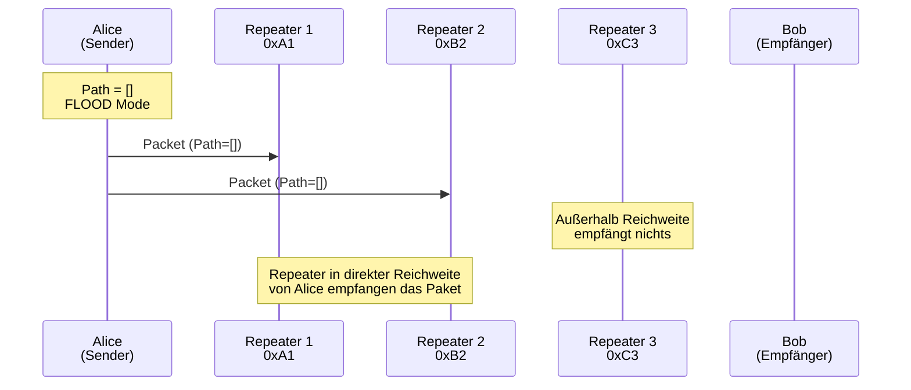

### 2. Repeater fügen sich zum Path hinzu

Jeder Repeater, der das Paket empfängt:
1. Prüft: "Habe ich dieses Paket schon gesehen?" (Duplicate Detection)
2. Wenn nein: Fügt eigenen Hash zum Path hinzu
3. Plant Weiterleitung mit RX Delay (SNR-basiert) + TX Delay (random)

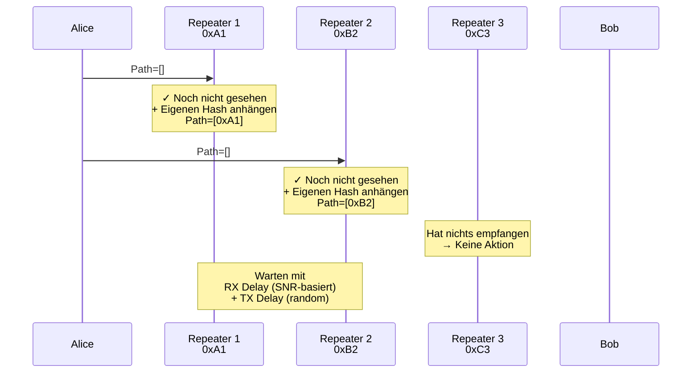

### 3. Weiterleitung mit aufgebautem Path

Die Repeater leiten das Paket mit ihrem Hash im Path weiter:

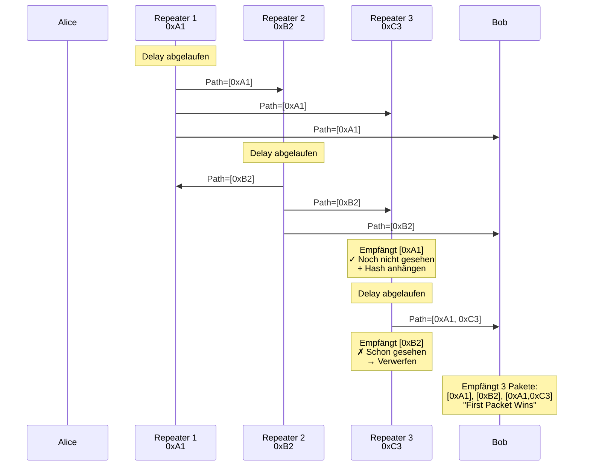

### 4. Empfänger erhält Pakete über verschiedene Wege

Bob empfängt dasselbe Paket über mehrere Pfade:

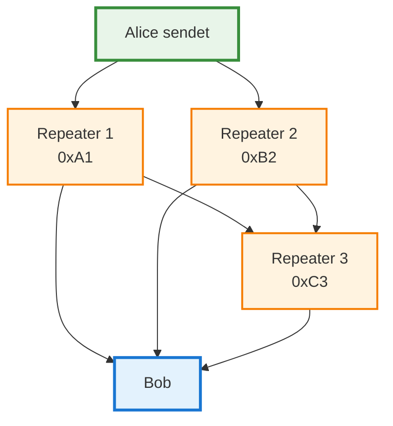

**Bob empfängt (aus Schritt 3):**
- Paket 1: Path = `[0xA1]` (direkt über Repeater 1) ← **Gewinnt!**
- Paket 2: Path = `[0xB2]` (direkt über Repeater 2) → Verworfen
- Paket 3: Path = `[0xA1, 0xC3]` (über Repeater 1 → Repeater 3) → Verworfen

Bob akzeptiert **nur das erste empfangene Paket** ("First Packet Wins"). Alle anderen werden als Duplikate verworfen.

### 5. Automatischer bidirektionaler Path-Learning

Nach dem Empfang einer FLOOD-Nachricht startet ein automatischer Prozess, der **beide Routen gleichzeitig lernt**:

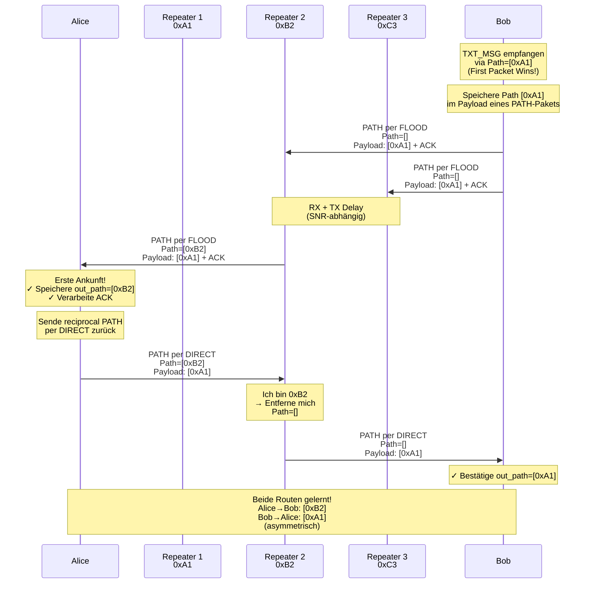

**Der Ablauf im Detail:**

1. **Bob empfängt TXT_MSG per FLOOD** mit Path=`[0xA1]` (erstes angekommenes Paket)
2. **Bob speichert den Pfad** `[0xA1]` (Bob → Alice)
3. **Bob sendet PATH-Paket per FLOOD**
   - Im Payload: Der empfangene Pfad `[0xA1]`
   - Als Extra: ACK für die Nachricht
4. **Alice empfängt PATH per FLOOD** mit neuem Path=`[0xB2]`
5. **Alice speichert den Pfad** `[0xB2]` (Alice → Bob)
6. **Alice verarbeitet das ACK** im PATH-Paket
7. **Alice sendet automatisch reciprocal PATH per DIRECT**
   - Via Pfad `[0xB2]` (aus dem Payload des empfangenen PATH)
   - Im Payload: Der ursprüngliche Pfad `[0xA1]`
8. **Bob empfängt PATH per DIRECT** und bestätigt den Pfad

**Ergebnis nach einer FLOOD-Nachricht:**
- ✅ Alice kennt Pfad zu Bob: `[0xB2]`
- ✅ Bob kennt Pfad zu Alice: `[0xA1]`
- ✅ Beide können DIRECT kommunizieren
- ✅ Routen sind **asymmetrisch** (in diesem Beispiel)

**Wichtig:**
- **Ein FLOOD reicht** für bidirektionales Path-Learning
- Die Routen **können asymmetrisch sein** (abhängig von der Netzwerktopologie)
- Jeder lernt den Pfad, über den das PATH-Paket zu ihm kam
- Kein Problem: Jede Richtung funktioniert unabhängig

## DIRECT-Routing: Source Routing

Nachdem Alice den Pfad zu Bob gelernt hat, verwendet sie DIRECT-Routing:

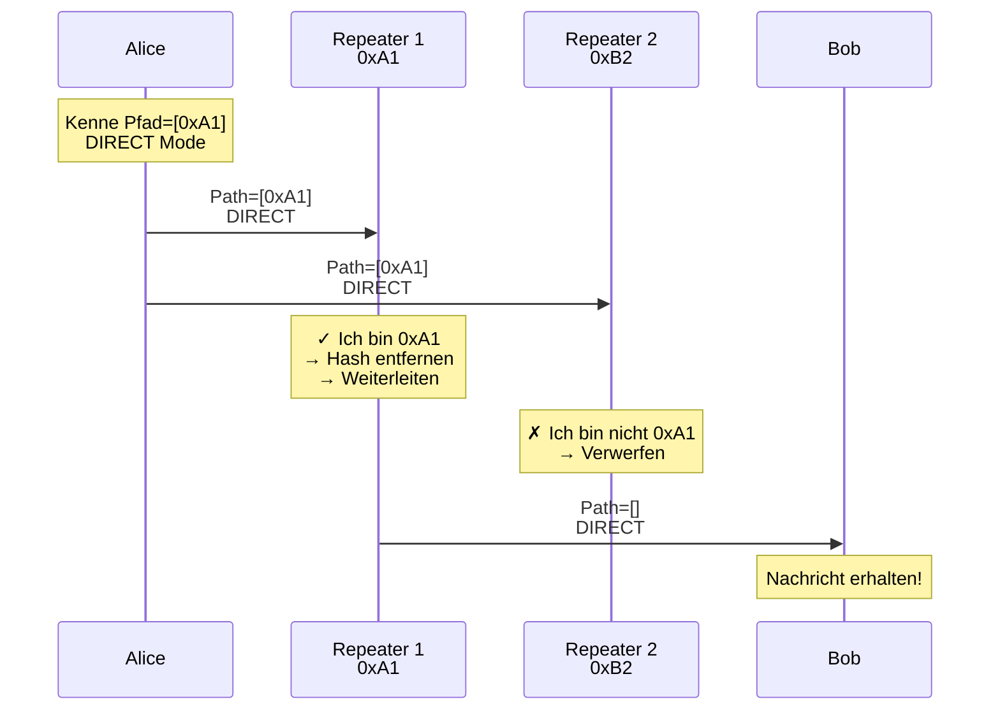

**Wichtig:**
- Nur der **erste Repeater im Path** (0xA1) leitet weiter
- Repeater 2 verwirft das Paket, da er nicht im Path ist
- Der Repeater **entfernt sich selbst** aus dem Path beim Weiterleiten
- Am Ende erhält Bob ein Paket mit leerem Path (`Path=[]`)

## Timing & Delays

MeshCore nutzt **zwei verschiedene Delay-Mechanismen**, um Kollisionen zu vermeiden und die besten Pfade zu bevorzugen:

### 1. RX Delay (Signalstärke-basiert, nur FLOOD)

:::info Nur für FLOOD
RX Delay wird **nur bei FLOOD-Paketen** angewendet. DIRECT-Pakete werden sofort verarbeitet (RX Delay = 0 ms).
:::

Beim Empfang eines FLOOD-Pakets wird zunächst basierend auf der **Signalstärke (SNR)** ein Delay berechnet:

```cpp
// Score aus SNR berechnen (0.0 = schwach, 1.0 = stark)
float score = (snr - snr_threshold) / 10.0;

// RX Delay berechnen
int rx_delay = (pow(rx_delay_base, 0.85 - score) - 1.0) * airtime;
```

**Formel:**
```
RX Delay = (rx_delay_base^(0.85 - Score) - 1) × Airtime
```

**Der `rx_delay_base` ist konfigurierbar:**
- **Default**: `10.0` (Basis-Implementierung)
- **Repeater-Firmware**: Oft `0.0` (deaktiviert)
- **Bereich**: `0.0 - 20.0`
- **CLI-Kommando**: `set rxdelay <wert>`
- **Effekt**: Höhere Basis = stärkerer SNR-Effekt

**Effekt:**
- **Starkes Signal** (hoher SNR) → hoher Score → **kurzes Delay** → frühe Verarbeitung
- **Schwaches Signal** (niedriger SNR) → niedriger Score → **langes Delay** → späte Verarbeitung
- Falls RX Delay < 50 ms: **sofortige Verarbeitung**
- Falls `rx_delay_base = 0.0`: RX Delay deaktiviert (nur TX Delay aktiv)

**Beispiel mit rx_delay_base = 10.0** (Airtime = 200 ms):
- SNR = +10 dB → Score ≈ 0.8 → RX Delay ≈ 20 ms
- SNR = 0 dB → Score ≈ 0.5 → RX Delay ≈ 224 ms
- SNR = -10 dB → Score ≈ 0.2 → RX Delay ≈ 894 ms

**Beispiel mit rx_delay_base = 0.0** (deaktiviert):
- RX Delay = 0 ms (unabhängig vom SNR)

:::tip Beste Pfade gewinnen
Durch das SNR-basierte Delay setzen sich automatisch die **besten Routen** durch: Repeater mit starkem Signal verarbeiten und senden früher, schwache Signale kommen zu spät und werden durch "First Packet Wins" verworfen.

**Hinweis**: In vielen Repeater-Firmwares ist RX Delay standardmäßig deaktiviert (`rx_delay_base = 0.0`), sodass nur TX Delay zur Kollisionsvermeidung verwendet wird.
:::

### 2. TX Delay (Zufalls-basiert)

Nach der Verarbeitung wird zusätzlich ein **zufälliges Delay** hinzugefügt, bevor das Paket weitergeleitet wird:

```cpp
uint32_t t = airtime * tx_delay_factor;
uint32_t delay = random(0, 5 * t);
```

**Formel:**
```
TX Delay = Zufallszahl(0, 5 × Airtime × tx_delay_factor)
```

**Der `tx_delay_factor` ist konfigurierbar:**
- **Default**: `0.5` (Repeater/Room Server)
- **Bereich**: `0.0 - 2.0`
- **CLI-Kommando**: `set txdelay <wert>`
- **Effekt**: Skaliert den Zufallsbereich, **nicht** ein festes zusätzliches Delay

**Beispiele** (Airtime = 200 ms):

| tx_delay_factor | t | TX Delay Bereich | Zweck |
|-----------------|---|------------------|-------|
| **0.5** (Default) | 100 ms | 0-500 ms | Ausgewogene Kollisionsvermeidung |
| **0.25** | 50 ms | 0-250 ms | Geringeres Delay, mehr Kollisionen |
| **1.0** | 200 ms | 0-1000 ms | Höheres Delay, weniger Kollisionen |
| **0.0** | 0 ms | 0 ms | TX Delay deaktiviert (nicht empfohlen) |

:::info Anpassung des TX Delay
Ein höherer `tx_delay_factor` vergrößert den Zufallsbereich und reduziert Kollisionen, erhöht aber die Latenz. Der Default-Wert `0.5` ist für die meisten Netzwerke optimal.
:::

### Gesamt-Delay

Das **Gesamt-Delay** vom Empfang bis zur Weiterleitung ist:

```
Gesamt-Delay = RX Delay + TX Delay
```

```mermaid
gantt
    title FLOOD Timing mit RX Delay (rx_delay_base = 10.0)
    dateFormat X
    axisFormat %L ms

    section Alice
    Sendet Paket              :0, 0

    section Repeater 1 (SNR +5dB)
    Empfängt                  :0, 0
    RX Delay (50ms)           :0, 50
    TX Delay (104ms)          :50, 154
    Sendet                    :154, 154

    section Repeater 2 (SNR -5dB)
    Empfängt                  :0, 0
    RX Delay (500ms)          :0, 500
    TX Delay (208ms)          :500, 708
    Sendet                    :708, 708

    section Repeater 3 (SNR +10dB)
    Empfängt                  :0, 0
    RX Delay (20ms)           :0, 20
    TX Delay (312ms)          :20, 332
    Sendet                    :332, 332
```

**Wichtig:** Repeater 2 mit schwachem Signal sendet zu spät - sein Paket wird durch "First Packet Wins" verworfen!

### TX Delay bei DIRECT

Bei DIRECT-Routing wird ebenfalls ein TX Delay verwendet, allerdings mit einem **kleineren Faktor**:

```cpp
uint32_t t = airtime * direct_tx_delay_factor;
uint32_t delay = random(0, 5 * t);
```

**Der `direct_tx_delay_factor` ist konfigurierbar:**
- **Default**: `0.2` (Repeater/Room Server/Sensor)
- **Bereich**: `0.0 - 2.0`
- **CLI-Kommando**: `set direct.txdelay <wert>`

**Beispiele** (Airtime = 200 ms):

| direct_tx_delay_factor | t | DIRECT TX Delay | Zweck |
|------------------------|---|-----------------|-------|
| **0.2** (Default) | 40 ms | 0-200 ms | Geringe Kollisionsvermeidung |
| **0.0** | 0 ms | 0 ms | Keine Verzögerung (minimale Latenz) |
| **0.5** | 100 ms | 0-500 ms | Wie FLOOD txdelay |

**Vergleich:**

| Routing-Modus | RX Delay | TX Delay | Gesamt | Grund |
|---------------|----------|----------|--------|-------|
| **FLOOD** | 20-900 ms (SNR-basiert) | 0-500 ms (random) | 20-1400 ms | SNR-Priorisierung + Kollisionsvermeidung |
| **DIRECT** | 0 ms | 0-200 ms (random) | 0-200 ms | Geringe Kollisionsvermeidung, niedrige Latenz |

*Bei direct_tx_delay_factor = 0.2 (Default). Mit 0.0 → 0 ms TX Delay.

## Prioritäten

MeshCore vergibt **Prioritäten** bei der Weiterleitung:

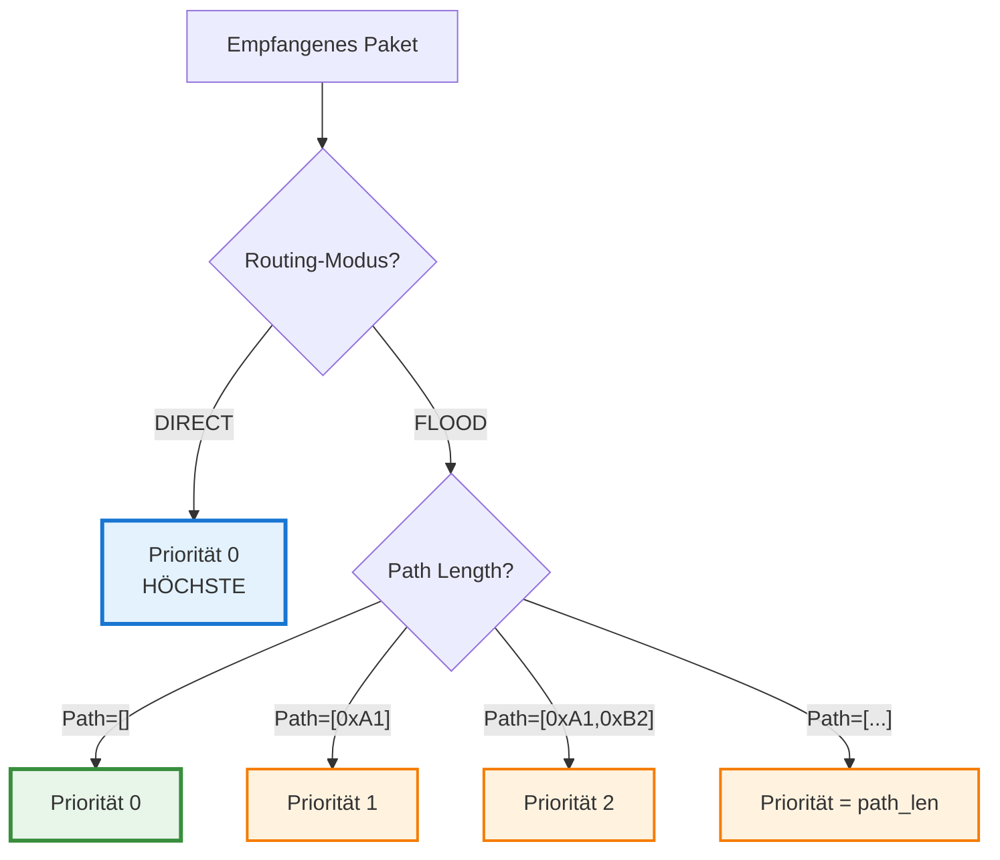

**Regel:**
```cpp
priority = path_len  // bei FLOOD
priority = 0         // bei DIRECT
```

**Bedeutung:**
- **Kürzere Pfade** = höhere Priorität (werden zuerst gesendet)
- **DIRECT** = immer höchste Priorität
- Verhindert, dass weit entfernte Repeater den Kanal blockieren

## Duplicate Detection

Jeder Repeater speichert empfangene Pakete in einer **Seen Table**:

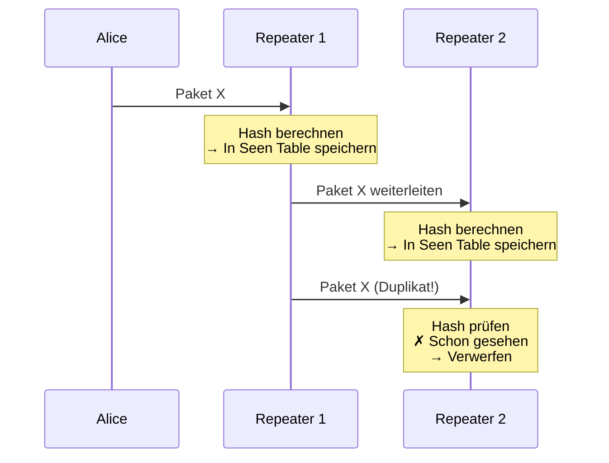

**Hash-Berechnung:**
```cpp
SHA256(payload_type + payload_len + payload)
```

**Wichtig:**
- Der Hash berücksichtigt **nicht** den Path
- Dasselbe Paket über verschiedene Wege hat denselben Hash
- Verhindert Endlos-Schleifen im Mesh

## Vollständiges FLOOD-Beispiel

Kompletter Nachrichtenfluss mit Timing und bidirektionalem Path-Learning:

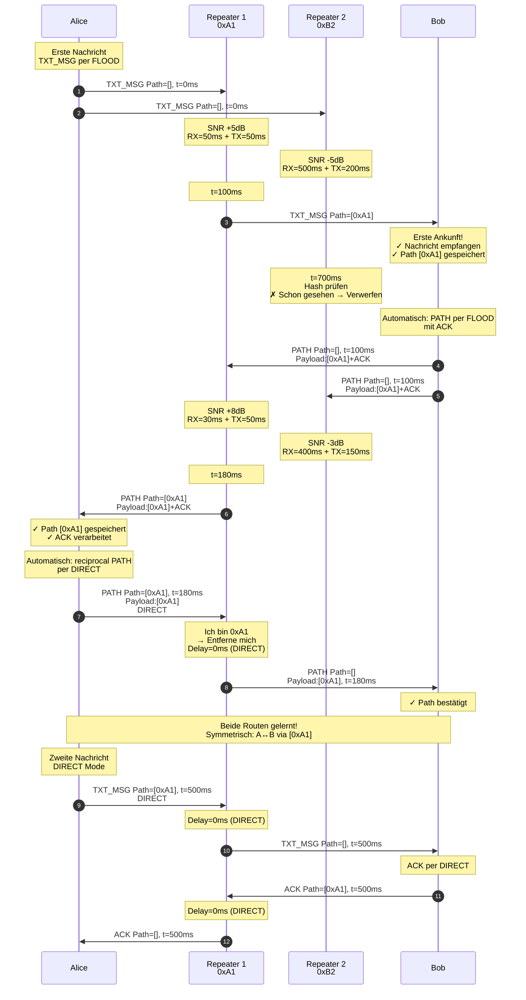

## Zusammenfassung

| Aspekt | FLOOD | DIRECT |
|--------|-------|--------|
| **Zweck** | Broadcast (Öffentlich) oder Path Learning (Privat) | Effiziente Punkt-zu-Punkt-Zustellung |
| **Path** | Wird aufgebaut (bei privaten Nachrichten) | Vorgegeben |
| **Weiterleitung** | Alle Repeater | Nur Hops im Path |
| **RX Delay** | 0-900 ms (SNR, konfigurierbar)* | 0 ms |
| **TX Delay** | 0-500 ms (random, konfigurierbar)** | 0-200 ms (random, konfigurierbar)*** |
| **Gesamt Delay** | 0-1400 ms | 0-200 ms |
| **Priorität** | path_len | 0 (höchste) |
| **Duplikate** | Viele (über verschiedene Wege) | Keine |
| **Airtime** | Hoch | Niedrig |
| **Anwendung** | Öffentliche Kanäle (immer) + erste private Nachricht | Folgende private Nachrichten |

*RX Delay: `rx_delay_base` (Default: `10.0`, Repeater oft: `0.0`)
**TX Delay: `tx_delay_factor` (Default: `0.5`)
***DIRECT TX Delay: `direct_tx_delay_factor` (Default: `0.2`, ergibt 0-200ms bei 200ms Airtime)

**Best Practice:**

**Öffentliche Kanalnachrichten:**
- Immer FLOOD-Modus (kein Path Learning möglich)
- Keine PATH-Pakete zurück
- Alle Teilnehmer empfangen die Nachricht

**Private Nachrichten:**
- Erste Nachricht: FLOOD (beide Richtungen lernen)
- Folgende Nachrichten: DIRECT (effizient)
- Nach ~180ms: Beide Pfade gelernt, DIRECT-Kommunikation möglich (bei guten Signalen)

**Allgemein:**
- Repeater ignorieren Duplikate automatisch
- "First Packet Wins" bei mehreren Pfaden
- Asymmetrische Routen sind normal und funktionieren

**Bidirektionales Path-Learning (nur private Nachrichten):**
- **Eine FLOOD-Nachricht** vom Sender löst automatischen Prozess aus
- Empfänger sendet automatisch PATH per FLOOD zurück
- Sender sendet automatisch reciprocal PATH per DIRECT
- **Gesamt: 2× FLOOD (hin & zurück) + 1× DIRECT**
- Beide Nodes kennen danach den optimalen Pfad zum anderen

**Hinweis zu asymmetrischen Routen:**
- Alice → Bob könnte über Repeater A gehen
- Bob → Alice könnte über Repeater B gehen
- Beide Richtungen verwenden den jeweils ersten empfangenen Pfad
- Kein Problem, da jeder Knoten seinen eigenen Pfad zur Gegenseite lernt
- Asymmetrische Routen sind ein gültiges und funktionierendes Szenario
